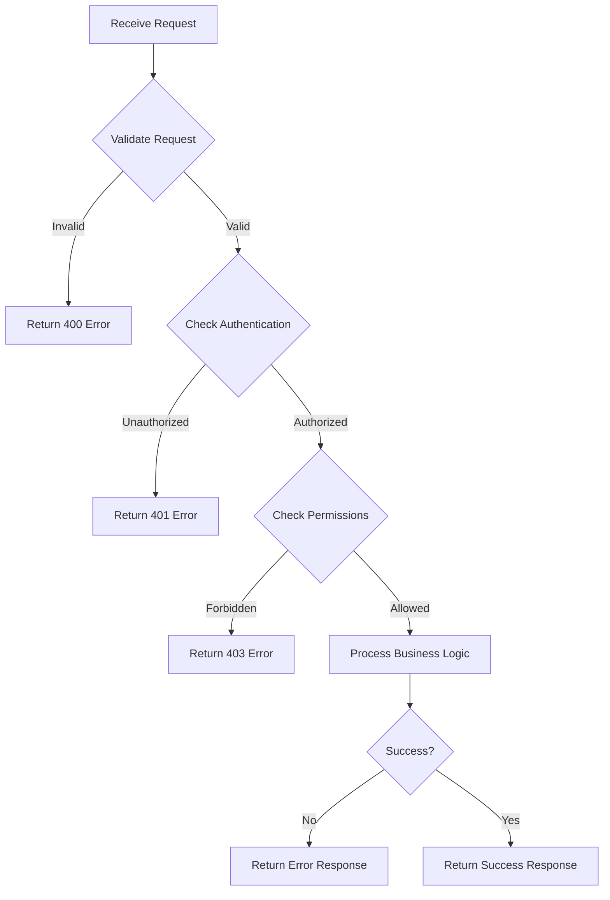

Create a new API Documentation page to document REST API endpoints.

**Requirements:**
1. All API docs MUST be created in `docs/content/r&d/apis/`
2. Use naming format based on endpoint path: remove leading slash, replace `/` with `-`, add action suffix
   - Examples: `POST /v1/journey` → `v1-journey-create.md`, `GET /v1/journey/{id}` → `v1-journey-get.md`
3. Ask the user for HTTP method if not provided (GET, POST, PUT, PATCH, DELETE)
4. Ask the user for URL path if not provided (e.g., `/v1/journey`)
5. Fill in today's date in YYYY-MM-DD format
6. Set initial status to "draft"
7. Create the `docs/content/r&d/apis/` directory if it doesn't exist
8. Create an `_index.md` file in `docs/content/r&d/apis/` if it doesn't exist

**Filename Generation:**
- Remove leading slash from path
- Replace all `/` with `-`
- Replace `{` and `}` (path parameters) with nothing
- Add action suffix based on method:
  - POST → `-create`
  - GET (with path params) → `-get`
  - GET (without path params) → `-list`
  - PUT → `-update`
  - PATCH → `-patch`
  - DELETE → `-delete`

**API Documentation Template to use:**

```markdown
---
title: "[Method] [Path]"
description: >
    [Brief summary of what this API endpoint does]
type: docs
weight: 1000
status: "draft"
date: YYYY-MM-DD
---

## API Overview

[Provide a clear description of what this API endpoint does, its purpose, and when it should be used. Include any important context about the resource it operates on.]

## Endpoint Details

- **Method:** `METHOD`
- **Path:** `/path`
- **Content-Type:** `application/json`
- **Base URL:** `https://api.example.com` (update with actual base URL)

## Authentication

**Required:** Yes | No

[Describe the authentication requirements for this endpoint:]
- Authentication method (e.g., OAuth2, JWT, API Key)
- Required scopes or permissions
- Example of how to include authentication in the request

**Example:**
```
Authorization: Bearer <access_token>
```

## Request

### Headers

| Header | Required | Description |
|--------|----------|-------------|
| `Content-Type` | Yes | Must be `application/json` |
| `Authorization` | Yes | Bearer token for authentication |
| `X-Custom-Header` | No | Optional custom header |

### Path Parameters

| Parameter | Type | Required | Description |
|-----------|------|----------|-------------|
| `id` | string | Yes | Unique identifier for the resource |

### Query Parameters

| Parameter | Type | Required | Description |
|-----------|------|----------|-------------|
| `limit` | integer | No | Maximum number of results to return (default: 20) |
| `offset` | integer | No | Number of results to skip (default: 0) |

### Request Body

**Schema:**

```json
{
  "field1": "string",
  "field2": 123,
  "field3": {
    "nestedField": "value"
  },
  "field4": ["array", "of", "values"]
}
```

**Field Descriptions:**

| Field | Type | Required | Description |
|-------|------|----------|-------------|
| `field1` | string | Yes | Description of field1 |
| `field2` | integer | No | Description of field2 |
| `field3` | object | No | Description of field3 |
| `field3.nestedField` | string | Yes | Description of nested field |
| `field4` | array[string] | No | Description of field4 |

**Example:**

```json
{
  "field1": "example value",
  "field2": 42,
  "field3": {
    "nestedField": "nested value"
  },
  "field4": ["item1", "item2"]
}
```

## Response

### Success Response (200 OK / 201 Created)

**Schema:**

```json
{
  "id": "string",
  "field1": "string",
  "field2": 123,
  "createdAt": "2025-01-01T00:00:00Z",
  "updatedAt": "2025-01-01T00:00:00Z"
}
```

**Field Descriptions:**

| Field | Type | Description |
|-------|------|-------------|
| `id` | string | Unique identifier for the resource |
| `field1` | string | Description of field1 |
| `field2` | integer | Description of field2 |
| `createdAt` | string (ISO 8601) | Timestamp when resource was created |
| `updatedAt` | string (ISO 8601) | Timestamp when resource was last updated |

**Example:**

```json
{
  "id": "550e8400-e29b-41d4-a716-446655440000",
  "field1": "example value",
  "field2": 42,
  "createdAt": "2025-01-01T12:00:00Z",
  "updatedAt": "2025-01-01T12:00:00Z"
}
```

## Error Responses

### 400 Bad Request

Request validation failed or malformed request body.

```json
{
  "error": "validation_error",
  "message": "Invalid request: field1 is required",
  "details": [
    {
      "field": "field1",
      "issue": "required field missing"
    }
  ]
}
```

### 401 Unauthorized

Missing or invalid authentication credentials.

```json
{
  "error": "unauthorized",
  "message": "Invalid or expired authentication token"
}
```

### 403 Forbidden

User does not have permission to access this resource.

```json
{
  "error": "forbidden",
  "message": "You do not have permission to perform this action"
}
```

### 404 Not Found

The requested resource does not exist.

```json
{
  "error": "not_found",
  "message": "Resource with id '123' not found"
}
```

### 500 Internal Server Error

An unexpected error occurred on the server.

```json
{
  "error": "internal_error",
  "message": "An unexpected error occurred. Please try again later."
}
```

## Business Logic Flow

Use Mermaid syntax to create a flowchart representing the business logic:



[Provide a narrative description of the business logic flow, explaining key decision points, validation steps, and processing stages]

## Implementation Notes

[Include any important implementation details, considerations, or gotchas for developers implementing or consuming this API:]

- Performance considerations
- Rate limiting details
- Caching behavior
- Idempotency guarantees
- Eventual consistency considerations
- Known limitations

## Related Documentation

- [Link to related ADRs]
- [Link to related User Journeys]
- [Link to related API documentation]
- [Link to code implementation: `api/endpoint/file.go:line`]

## Examples

### Example 1: [Scenario Name]

**Request:**

```bash
curl -X METHOD https://api.example.com/path \
  -H "Authorization: Bearer <token>" \
  -H "Content-Type: application/json" \
  -d '{
    "field1": "value"
  }'
```

**Response:**

```json
{
  "id": "550e8400-e29b-41d4-a716-446655440000",
  "field1": "value"
}
```

### Example 2: [Another Scenario]

[Add more examples as needed]

## Changelog

| Date | Version | Changes |
|------|---------|---------|
| YYYY-MM-DD | 1.0 | Initial API documentation |

```

**Status values:** `draft` | `reviewed` | `published` | `deprecated`

**_index.md template for `docs/content/r&d/apis/`:**

```markdown
---
title: "API Documentation"
description: "REST API endpoint documentation for the Journeys application"
type: docs
weight: 30
---

This section contains detailed documentation for all REST API endpoints in the Journeys application.

## Overview

The Journeys API provides programmatic access to journey management functionality. All endpoints use JSON for request and response bodies and follow RESTful conventions.

## API Endpoints

Browse the documentation for individual API endpoints using the navigation menu.
```
