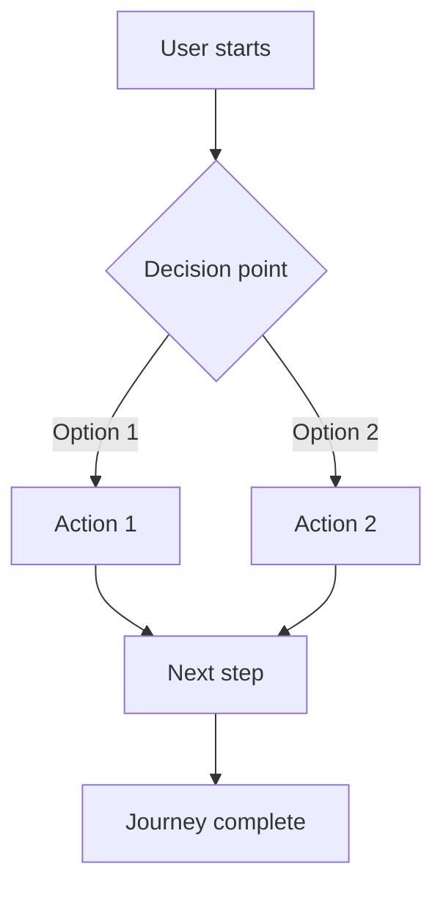

Create a new User Journey document to define user flows and technical requirements.

**Requirements:**
1. All User Journeys MUST be created in `docs/content/r&d/user-journeys/`
2. Use naming format: `NNNN-title-with-dashes.md` where NNNN is zero-padded sequential (e.g., `0001-user-registration.md`)
3. Ask the user for the journey title/topic if not provided
4. Determine the next sequential number by checking existing journeys in `docs/content/r&d/user-journeys/`
5. Fill in today's date in YYYY-MM-DD format
6. Set initial status to "draft"
7. Create the `docs/content/r&d/user-journeys/` directory if it doesn't exist
8. Create an `_index.md` file in `docs/content/r&d/user-journeys/` if it doesn't exist

**User Journey Template to use:**

```markdown
---
title: "[NNNN] [Journey Title]"
description: >
    [Brief summary of what this user journey accomplishes]
type: docs
weight: [NNNN]
status: "draft"
date: YYYY-MM-DD
owner: ""
stakeholders: []
---

## Overview

[Provide a brief description of the user journey, its purpose, and the user persona(s) it serves. Explain the business value and user goals.]

## Journey Flow Diagram

Use Mermaid syntax to create a flowchart representing the user journey:



[Provide a narrative description of the flow diagram, explaining key decision points and user actions]

## Technical Requirements

### Access Control

#### REQ-AC-001
- **Priority**: P0 | P1 | P2
- **Description**: [What access control is needed]
- **Rationale**: [Why this is important]

### Rate Limits

#### REQ-RL-001
- **Priority**: P0 | P1 | P2
- **Description**: [What rate limiting is needed]
- **Rationale**: [Why this is important]

### Analytics

#### REQ-AN-001
- **Priority**: P0 | P1 | P2
- **Description**: [What analytics/tracking is needed]
- **Rationale**: [Why this is important]

### Data Storage

#### REQ-DS-001
- **Priority**: P0 | P1 | P2
- **Description**: [What data needs to be stored]
- **Rationale**: [Why this is important]

### Other Requirements

#### REQ-OT-001
- **Priority**: P0 | P1 | P2
- **Description**: [Any other technical requirements]
- **Rationale**: [Why this is important]

## Success Metrics

[Define how success will be measured for this journey. Include both quantitative metrics (e.g., completion rate, time to complete) and qualitative metrics (e.g., user satisfaction).]

- **Metric 1**: [Description and target]
- **Metric 2**: [Description and target]
- **Metric 3**: [Description and target]

## Related Documentation

- [Link to related ADRs]
- [Link to API documentation]
- [Link to related user journeys]
- [Link to design mockups or wireframes]

## Notes

[Any additional context, constraints, or considerations that don't fit in the sections above]
```

**Status values:** `draft` | `in-review` | `approved` | `implemented` | `deprecated`

**Priority levels:**
- `P0` (Must Have): Critical requirements that must be included in the initial design
- `P1` (Should Have): Important requirements that should be included but can be phased in if necessary
- `P2` (Nice to Have): Optional enhancements for future iterations

**Requirement ID format:** `REQ-[CATEGORY]-NNN`
- `AC` = Access Control
- `RL` = Rate Limits
- `AN` = Analytics
- `DS` = Data Storage
- `OT` = Other

**Reference:** Mermaid diagram syntax - https://mermaid.js.org/syntax/flowchart.html
