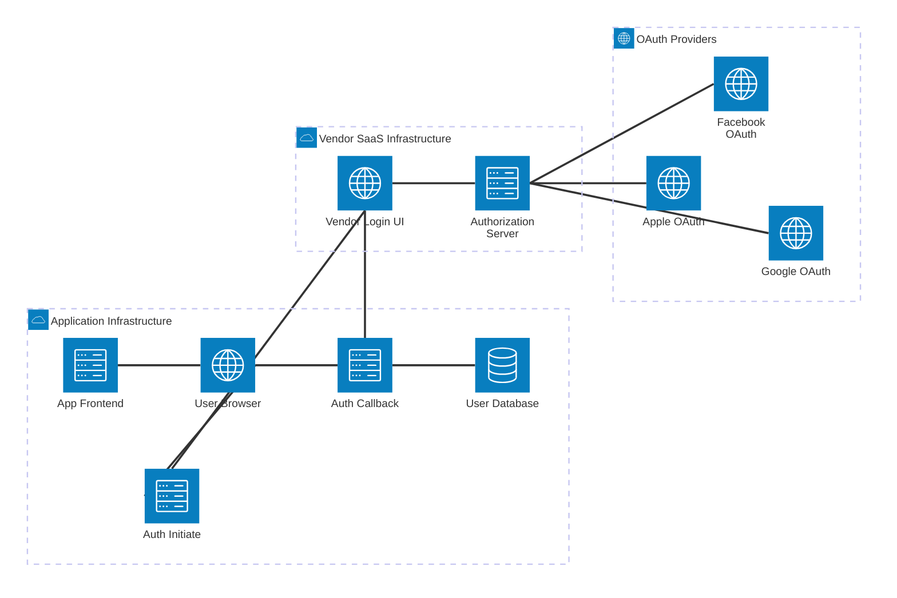
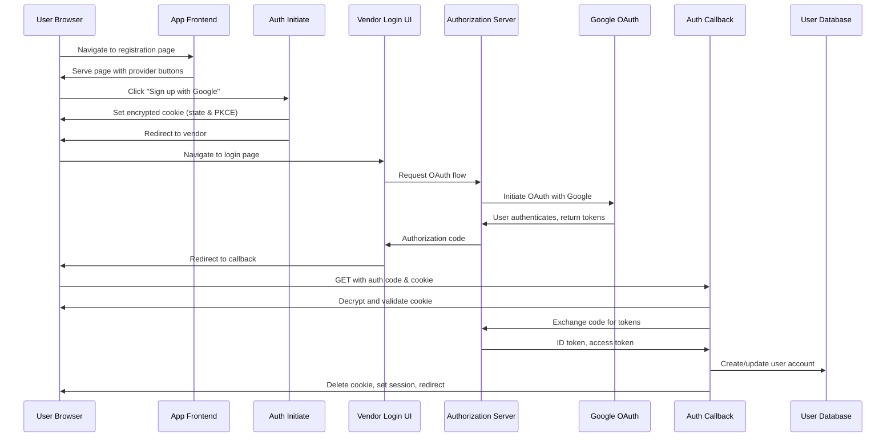
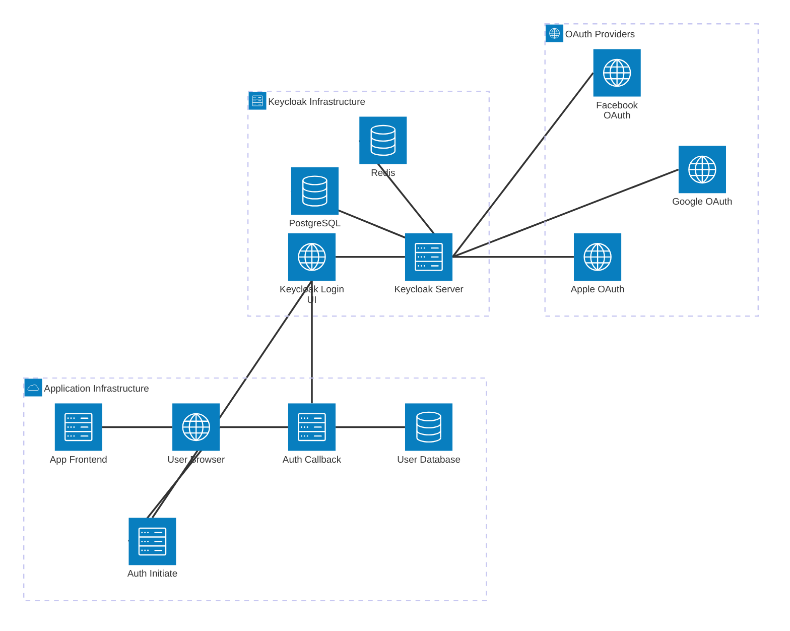
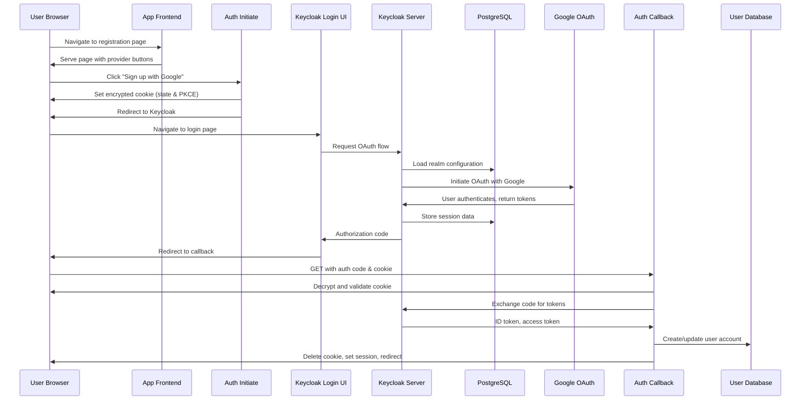

<!--
ADR Categories:
- strategic: High-level architectural decisions (frameworks, auth strategies, cross-cutting patterns)
- user-journey: Solutions for specific user journey problems (feature implementation approaches)
- api-design: API endpoint design decisions (pagination, filtering, bulk operations)
-->

## Context and Problem Statement

User Journey 0001 (User Registration) defines the flow for new users to create accounts via OAuth2/OIDC providers (Google, Facebook, Apple). This ADR determines the technical implementation approach for the registration flow, including how to handle new users, store account data, generate internal user identifiers, and ensure idempotency for repeated OAuth callbacks.

How should we implement the user registration flow to ensure secure, reliable account creation while providing a smooth user experience?

<!-- This is an optional element. Feel free to remove. -->
## Decision Drivers

<!--
For Strategic ADRs, consider: scalability, maintainability, team expertise, ecosystem maturity, vendor lock-in
For User Journey ADRs, consider: user experience, security, implementation complexity, timeline
For API Design ADRs, consider: client usage patterns, performance, backward compatibility, API conventions
-->

* User experience - Registration should be seamless with minimal friction
* Security - Must prevent account hijacking and ensure proper OAuth validation
* Implementation complexity - Solution should be straightforward to implement and maintain
* Idempotency - Repeated OAuth callbacks should not create duplicate accounts
* Data integrity - User identifiers must be unique and stable across sessions
* Timeline - Need to implement quickly to unblock other user journeys

## Considered Options

* Vendor-Provided Registration UI (SaaS)
* Vendor-Provided Registration UI (Self-Hosted)
* [option 3]
* ...

## Decision Outcome

Chosen option: "[option 1]", because [justification. e.g., only option, which meets k.o. criterion decision driver | which resolves force force | ... | comes out best (see below)].

<!-- This is an optional element. Feel free to remove. -->
### Consequences

* Good, because [positive consequence, e.g., improvement of one or more desired qualities, ...]
* Bad, because [negative consequence, e.g., compromising one or more desired qualities, ...]
* ...

<!-- This is an optional element. Feel free to remove. -->
### Confirmation

[Describe how the implementation of/compliance with the ADR is confirmed. E.g., by a review or an ArchUnit test.
 Although we classify this element as optional, it is included in most ADRs.]

<!-- This is an optional element. Feel free to remove. -->
## Pros and Cons of the Options

### Vendor-Provided Registration UI (SaaS)

Use a third-party SaaS identity provider's hosted login/registration pages where users are redirected to the vendor's domain for authentication, then returned to the application with an authorization code. Examples include Auth0 Universal Login and AWS Cognito Hosted UI.

**How It Works:**

**Infrastructure Components:**

*Frontend (Your Infrastructure):*
- App Frontend (SPA, server-rendered, or static pages) - Serves registration/login page with provider selection buttons

*Backend Endpoints (Your Infrastructure):*
- `GET /v1/auth/{provider}` - Generates OAuth state/PKCE, sets encrypted cookie, redirects to vendor authorization endpoint
- `GET /v1/auth/{provider}/callback` - Decrypts/validates cookie, exchanges auth code for tokens, provisions user, creates session

*Storage (Your Infrastructure):*
- **Encrypted cookies** for OAuth state and PKCE values (stateless, 10-minute expiration via httpOnly, secure, SameSite cookies)
- Database for user accounts (user ID, provider ID, provider user ID, email, timestamps)
- See [OAuth State and PKCE Storage Alternatives](../analysis/security/pkce.md) for detailed analysis of this approach

*External Dependencies (Vendor SaaS):*
- Vendor-hosted authentication UI (Auth0/Cognito servers)
- Vendor authorization server
- OAuth provider integrations (managed by vendor)

**Deployment Model:**
- Vendor hosts all authentication UI on their infrastructure (`your-tenant.auth0.com`)
- Your application hosts only callback endpoints and business logic
- Configuration: Register client ID/secret and redirect URIs in vendor dashboard
- Optional: Custom domain CNAME (`login.yourapp.com` → vendor infrastructure) for seamless branding

**Configuration Requirements:**
- Vendor account and tenant setup
- Client credentials (client ID, client secret) from vendor
- Allowed redirect URIs: `https://yourapp.com/v1/auth/{provider}/callback`
- OAuth scopes: `openid email profile`
- Provider connections: Configure Google/Facebook/Apple OAuth apps in vendor dashboard

* Good, because implementation is fastest (hours to days, configuration-only)
* Good, because zero infrastructure to manage for authentication UI
* Good, because security is handled by specialists (OAuth best practices, MFA, bot protection, breach detection)
* Good, because automatic scaling and high availability included
* Good, because built-in features come free (passwordless, MFA, anomaly detection, compliance certifications)
* Good, because vendor handles all updates and security patches
* Neutral, because customization varies by vendor (Auth0: moderate via CSS/templates, Cognito: very limited)
* Neutral, because cost scales with users (per-MAU pricing: $0-$200/month small scale, increases with growth)
* Bad, because UI control is limited (cannot fully customize flow or pixel-perfect branding without significant effort)
* Bad, because domain change during auth (user sees `auth0.com` or similar, potential trust/confusion unless custom domain configured)
* Bad, because vendor lock-in risk (migration complexity if switching providers, proprietary features create dependencies)
* Bad, because long-term costs can become significant (Auth0: ~$0.023/MAU, costs grow linearly with user base)

### Vendor-Provided Registration UI (Self-Hosted)

Use a self-hosted identity provider (Keycloak) that you deploy and manage on your own infrastructure. Users are redirected to your Keycloak instance for authentication, providing full control over the authentication UI and infrastructure.

**How It Works:**

**Infrastructure Components:**

*Frontend (Your Infrastructure):*
- App Frontend (SPA, server-rendered, or static pages) - Serves registration/login page with provider selection buttons

*Backend Endpoints (Your Infrastructure):*
- `GET /v1/auth/{provider}` - Generates OAuth state/PKCE, sets encrypted cookie, redirects to Keycloak authorization endpoint
- `GET /v1/auth/{provider}/callback` - Decrypts/validates cookie, exchanges auth code for tokens, provisions user, creates session

*Application Storage (Your Infrastructure):*
- **Encrypted cookies** for OAuth state and PKCE values (stateless, 10-minute expiration via httpOnly, secure, SameSite cookies)
- Database for user accounts (user ID, provider ID, provider user ID, email, timestamps)
- See [OAuth State and PKCE Storage Alternatives](../analysis/security/pkce.md) for detailed analysis of this approach

*Keycloak Infrastructure (Your Infrastructure):*
- Keycloak server (Kubernetes pods, Docker containers, or VMs)
- PostgreSQL database for Keycloak data (users, sessions, configurations)
- Redis cache for Keycloak session management
- Load balancer for high availability
- Monitoring and logging infrastructure

*External Dependencies:*
- OAuth provider endpoints (Google, Facebook, Apple APIs)

**Deployment Model:**
- Deploy Keycloak on your infrastructure (Kubernetes cluster, Docker, or VMs)
- Keycloak requires its own database, caching, and load balancing
- Your application hosts callback endpoints (same pattern as SaaS)
- Full control over infrastructure, updates, customization, and data
- Requires DevOps expertise for deployment, monitoring, and maintenance

**Configuration Requirements:**
- Keycloak installation and setup (Helm chart, Docker Compose, or manual)
- PostgreSQL database provisioning
- Redis cache setup
- Client credentials configured in Keycloak admin console
- Allowed redirect URIs: `https://yourapp.com/v1/auth/{provider}/callback`
- OAuth scopes: `openid email profile`
- Provider connections: Configure Google/Facebook/Apple OAuth apps in Keycloak

* Good, because full UI customization control (Freemarker templates, custom themes, HTML/CSS/JS)
* Good, because no vendor lock-in (open source, can migrate easily)
* Good, because data sovereignty (all user data stays on your infrastructure)
* Good, because long-term cost savings at scale (no per-user fees, only infrastructure costs)
* Good, because no external dependencies for authentication UI
* Good, because complete control over updates and feature rollout
* Neutral, because requires upfront infrastructure investment
* Neutral, because theme customization requires technical expertise ("elbow grease")
* Bad, because high DevOps burden (deployment, monitoring, updates, security patches, backups)
* Bad, because slower implementation timeline (weeks vs days for SaaS)
* Bad, because requires security expertise to maintain (you're responsible for patching vulnerabilities)
* Bad, because operational complexity (database management, scaling, high availability, disaster recovery)
* Bad, because you handle all OAuth provider integrations and updates yourself

### [option 2]

[example | description | pointer to more information | ...]

* Good, because [argument a]
* Good, because [argument b]
* Neutral, because [argument c]
* Bad, because [argument d]
* ...

### [option 3]

[example | description | pointer to more information | ...]

* Good, because [argument a]
* Good, because [argument b]
* Neutral, because [argument c]
* Bad, because [argument d]
* ...

<!-- This is an optional element. Feel free to remove. -->
## More Information

**Related Documentation:**
- [User Journey 0001: User Registration](../user-journeys/0001-user-registration.md)
- [ADR-0002: SSO Authentication Strategy](0002-sso-authentication-strategy.md)
- [ADR-0003: OAuth2/OIDC Provider Selection](0003-oauth2-oidc-provider-selection.md)
- [ADR-0004: Session Management](0004-session-management.md)
- [OAuth State and PKCE Storage Alternatives](../analysis/security/pkce.md) - Analysis of storage options for OAuth state and PKCE values
- [API: GET /v1/auth/{provider}](../apis/v1-auth-provider-initiate.md)
- [API: GET /v1/auth/{provider}/callback](../apis/v1-auth-provider-callback.md)

**Related Requirements (from User Journey 0001):**
- REQ-AC-001: Only authenticated users can create accounts
- REQ-AC-002: Accounts linked to OAuth provider identity
- REQ-AC-003: Support Google, Facebook, Apple providers
- REQ-DS-001: Store user ID, provider ID, provider user ID
- REQ-DS-002: Store timestamps (created, last login)
