```mermaid
architecture-beta
    group mobile(mobile)[Mobile Device]
    group app(cloud)[Application Infrastructure]
    group oauth(internet)[OAuth Providers]

    service nativeapp(mobile)[Native App] in mobile
    service browser(mobile)[System Browser] in mobile

    service initiate(server)[Auth Initiate] in app
    service callback(server)[Auth Callback] in app
    service db(database)[User Database] in app

    service google(internet)[Google OAuth] in oauth
    service facebook(internet)[Facebook OAuth] in oauth
    service apple(internet)[Apple OAuth] in oauth

    nativeapp:R -- L:browser
    browser:T -- B:initiate
    initiate:R -- L:google
    initiate:R -- L:facebook
    initiate:R -- L:apple
    google:B -- T:callback
    facebook:B -- T:callback
    apple:B -- T:callback
    callback:T -- B:browser
    browser:L -- R:nativeapp
    callback:R -- L:db
```

<!--
ADR Categories:
- strategic: High-level architectural decisions (frameworks, auth strategies, cross-cutting patterns)
- user-journey: Solutions for specific user journey problems (feature implementation approaches)
- api-design: API endpoint design decisions (pagination, filtering, bulk operations)
-->

## Context and Problem Statement

User Journey 0001 (User Registration) defines the flow for new users to create accounts via OAuth2/OIDC providers (Google, Facebook, Apple). This ADR determines the technical implementation approach for the registration flow, including how to handle new users, store account data, generate internal user identifiers, and ensure idempotency for repeated OAuth callbacks.

How should we implement the user registration flow to ensure secure, reliable account creation while providing a smooth user experience?

<!-- This is an optional element. Feel free to remove. -->
## Decision Drivers

<!--
For Strategic ADRs, consider: scalability, maintainability, team expertise, ecosystem maturity, vendor lock-in
For User Journey ADRs, consider: user experience, security, implementation complexity, timeline
For API Design ADRs, consider: client usage patterns, performance, backward compatibility, API conventions
-->

* User experience - Registration should be seamless with minimal friction
* Security - Must prevent account hijacking and ensure proper OAuth validation
* Implementation complexity - Solution should be straightforward to implement and maintain
* Idempotency - Repeated OAuth callbacks should not create duplicate accounts
* Data integrity - User identifiers must be unique and stable across sessions
* Timeline - Need to implement quickly to unblock other user journeys

## Considered Options

* Vendor-Provided Registration UI (SaaS)
* Vendor-Provided Registration UI (Self-Hosted)
* Custom-Built OAuth UI (Backend-for-Frontend Pattern)

## Decision Outcome

Chosen option: "Custom-Built OAuth UI (Backend-for-Frontend Pattern)", because it best meets the project's decision drivers for user experience, implementation complexity, and timeline while avoiding vendor lock-in. The custom UI provides complete UX control and seamless branding (users stay on ourapp.com), aligns with the existing stateless architecture (ADR-0004), and requires only frontend development effort since the backend OAuth implementation is straightforward. The 2-4 week implementation timeline is acceptable given the project's early stage, and the one-time development investment avoids ongoing per-user costs.

<!-- This is an optional element. Feel free to remove. -->
### Consequences

* Good, because users experience seamless branding without visible redirects to external authentication services
* Good, because complete UX control enables pixel-perfect branding, custom workflows, and A/B testing capabilities
* Good, because no vendor lock-in for the authentication UX layer (can iterate independently)
* Good, because simplest infrastructure option (no vendor auth service to deploy or maintain like Keycloak)
* Good, because no per-user costs (one-time development investment vs scaling subscription fees)
* Good, because Backend-for-Frontend pattern provides strong security (confidential OAuth client, tokens never exposed to browser)
* Good, because aligns with ADR-0004 stateless JWT architecture using encrypted cookies for OAuth state/PKCE
* Bad, because requires building and maintaining custom UI components (login page, error states, loading screens, responsive design)
* Bad, because responsible for UI security implementation (XSS prevention, CSRF protection, CSP headers)
* Bad, because requires frontend development expertise and 2-4 weeks implementation time vs 1-2 days for SaaS vendor
* Bad, because must handle browser compatibility testing and ongoing maintenance for browser/design updates

<!-- This is an optional element. Feel free to remove. -->
### Confirmation

Implementation of this ADR will be confirmed through:

1. **Code Review**: Frontend UI components and backend OAuth endpoints reviewed for security best practices (CSRF, XSS prevention, encrypted cookies)
2. **Integration Testing**: Automated tests for complete OAuth flows with Google/Facebook/Apple providers including error scenarios
3. **Security Audit**: Verification that encrypted cookies use httpOnly, secure, SameSite attributes and state/PKCE validation is correct
4. **Browser Compatibility Testing**: Manual verification that login flows work across Chrome, Firefox, Safari, Edge (desktop and mobile)
5. **Accessibility Audit**: Confirm WCAG AA compliance for custom login/registration pages
6. **Architecture Alignment**: Verify OAuth state storage uses encrypted cookies as documented in [OAuth State and PKCE Storage Alternatives](../analysis/security/pkce.md)
7. **Documentation**: API endpoints, error handling, and UI components documented for future maintenance

<!-- This is an optional element. Feel free to remove. -->
## Pros and Cons of the Options

### Vendor-Provided Registration UI (SaaS)

Use a third-party SaaS identity provider's hosted login/registration pages where users are redirected to the vendor's domain for authentication, then returned to the application with an authorization code. Examples include Auth0 Universal Login and AWS Cognito Hosted UI.

**How It Works:**

**Infrastructure Components:**

*Frontend (Your Infrastructure):*
- App Frontend (SPA, server-rendered, or static pages) - Serves registration/login page with provider selection buttons

*Backend Endpoints (Your Infrastructure):*
- `GET /v1/auth/{provider}` - Generates OAuth state/PKCE, sets encrypted cookie, redirects to vendor authorization endpoint
- `GET /v1/auth/{provider}/callback` - Decrypts/validates cookie, exchanges auth code for tokens, provisions user, creates session

*Storage (Your Infrastructure):*
- **Encrypted cookies** for OAuth state and PKCE values (stateless, 10-minute expiration via httpOnly, secure, SameSite cookies)
- Database for user accounts (user ID, provider ID, provider user ID, email, timestamps)
- See [OAuth State and PKCE Storage Alternatives](../analysis/security/pkce.md) for detailed analysis of this approach

*External Dependencies (Vendor SaaS):*
- Vendor-hosted authentication UI (Auth0/Cognito servers)
- Vendor authorization server
- OAuth provider integrations (managed by vendor)

**Deployment Model:**
- Vendor hosts all authentication UI on their infrastructure (`your-tenant.auth0.com`)
- Your application hosts only callback endpoints and business logic
- Configuration: Register client ID/secret and redirect URIs in vendor dashboard
- Optional: Custom domain CNAME (`login.yourapp.com` → vendor infrastructure) for seamless branding

**Configuration Requirements:**
- Vendor account and tenant setup
- Client credentials (client ID, client secret) from vendor
- Allowed redirect URIs: `https://yourapp.com/v1/auth/{provider}/callback`
- OAuth scopes: `openid email profile`
- Provider connections: Configure Google/Facebook/Apple OAuth apps in vendor dashboard

* Good, because implementation is fastest (hours to days, configuration-only)
* Good, because zero infrastructure to manage for authentication UI
* Good, because security is handled by specialists (OAuth best practices, MFA, bot protection, breach detection)
* Good, because automatic scaling and high availability included
* Good, because built-in features come free (passwordless, MFA, anomaly detection, compliance certifications)
* Good, because vendor handles all updates and security patches
* Neutral, because customization varies by vendor (Auth0: moderate via CSS/templates, Cognito: very limited)
* Neutral, because cost scales with users (per-MAU pricing: $0-$200/month small scale, increases with growth)
* Bad, because UI control is limited (cannot fully customize flow or pixel-perfect branding without significant effort)
* Bad, because domain change during auth (user sees `auth0.com` or similar, potential trust/confusion unless custom domain configured)
* Bad, because vendor lock-in risk (migration complexity if switching providers, proprietary features create dependencies)
* Bad, because long-term costs can become significant (Auth0: ~$0.023/MAU, costs grow linearly with user base)

### Vendor-Provided Registration UI (Self-Hosted)

Use a self-hosted identity provider (Keycloak) that you deploy and manage on your own infrastructure. Users are redirected to your Keycloak instance for authentication, providing full control over the authentication UI and infrastructure.

**How It Works:**

**Infrastructure Components:**

*Frontend (Your Infrastructure):*
- App Frontend (SPA, server-rendered, or static pages) - Serves registration/login page with provider selection buttons

*Backend Endpoints (Your Infrastructure):*
- `GET /v1/auth/{provider}` - Generates OAuth state/PKCE, sets encrypted cookie, redirects to Keycloak authorization endpoint
- `GET /v1/auth/{provider}/callback` - Decrypts/validates cookie, exchanges auth code for tokens, provisions user, creates session

*Application Storage (Your Infrastructure):*
- **Encrypted cookies** for OAuth state and PKCE values (stateless, 10-minute expiration via httpOnly, secure, SameSite cookies)
- Database for user accounts (user ID, provider ID, provider user ID, email, timestamps)
- See [OAuth State and PKCE Storage Alternatives](../analysis/security/pkce.md) for detailed analysis of this approach

*Keycloak Infrastructure (Your Infrastructure):*
- Keycloak server (Kubernetes pods, Docker containers, or VMs)
- PostgreSQL database for Keycloak data (users, sessions, configurations)
- Redis cache for Keycloak session management
- Load balancer for high availability
- Monitoring and logging infrastructure

*External Dependencies:*
- OAuth provider endpoints (Google, Facebook, Apple APIs)

**Deployment Model:**
- Deploy Keycloak on your infrastructure (Kubernetes cluster, Docker, or VMs)
- Keycloak requires its own database, caching, and load balancing
- Your application hosts callback endpoints (same pattern as SaaS)
- Full control over infrastructure, updates, customization, and data
- Requires DevOps expertise for deployment, monitoring, and maintenance

**Configuration Requirements:**
- Keycloak installation and setup (Helm chart, Docker Compose, or manual)
- PostgreSQL database provisioning
- Redis cache setup
- Client credentials configured in Keycloak admin console
- Allowed redirect URIs: `https://yourapp.com/v1/auth/{provider}/callback`
- OAuth scopes: `openid email profile`
- Provider connections: Configure Google/Facebook/Apple OAuth apps in Keycloak

* Good, because full UI customization control (Freemarker templates, custom themes, HTML/CSS/JS)
* Good, because no vendor lock-in (open source, can migrate easily)
* Good, because data sovereignty (all user data stays on your infrastructure)
* Good, because long-term cost savings at scale (no per-user fees, only infrastructure costs)
* Good, because no external dependencies for authentication UI
* Good, because complete control over updates and feature rollout
* Neutral, because requires upfront infrastructure investment
* Neutral, because theme customization requires technical expertise ("elbow grease")
* Bad, because high DevOps burden (deployment, monitoring, updates, security patches, backups)
* Bad, because slower implementation timeline (weeks vs days for SaaS)
* Bad, because requires security expertise to maintain (you're responsible for patching vulnerabilities)
* Bad, because operational complexity (database management, scaling, high availability, disaster recovery)
* Bad, because you handle all OAuth provider integrations and updates yourself

### Custom-Built OAuth UI (Backend-for-Frontend Pattern)

Build a custom login/registration UI served from your application domain using the Backend-for-Frontend (BFF) security pattern. Your application serves branded login pages on your domain while the backend handles OAuth flows directly with providers (Google, Facebook, Apple). Users experience seamless branding without visible redirects to external authentication services.

**How It Works:**

**Infrastructure Components:**

*Frontend (Your Infrastructure - CUSTOM BUILT):*
- Custom Login/Registration UI (HTML/CSS/JavaScript) - Your fully branded login pages served from your domain
- Provider selection buttons styled to match your brand
- Loading states and transitions during OAuth flow
- Success/error message displays
- Post-authentication dashboard or onboarding

*Backend Endpoints (Your Infrastructure - SAME as vendor options):*
- `GET /v1/auth/{provider}` - Generates OAuth state/PKCE, sets encrypted cookie, redirects to provider
- `GET /v1/auth/{provider}/callback` - Decrypts/validates cookie, exchanges auth code for tokens, provisions user, creates session

*Storage (Your Infrastructure - SAME as vendor options):*
- **Encrypted cookies** for OAuth state and PKCE values (stateless, 10-minute expiration via httpOnly, secure, SameSite cookies)
- Database for user accounts (user ID, provider ID, provider user ID, email, timestamps)
- See [OAuth State and PKCE Storage Alternatives](../analysis/security/pkce.md) for detailed analysis

*External Dependencies:*
- Direct OAuth provider integrations (Google, Facebook, Apple APIs)
- OAuth provider developer console configuration (client IDs, secrets, redirect URIs)

**Deployment Model:**
- You host all UI components on your infrastructure (`yourapp.com/signup`, `yourapp.com/login`)
- Backend APIs handle OAuth protocol mechanics (same as vendor UI options)
- No vendor authentication service layer required
- Follows Backend-for-Frontend (BFF) security pattern (industry best practice 2024)
- Frontend serves branded UI, backend acts as confidential OAuth client

**Configuration Requirements:**
- OAuth provider developer console setup (Google Cloud Console, Facebook App Dashboard, Apple Developer)
- Client credentials (client ID, client secret) from each provider
- Allowed redirect URIs: `https://yourapp.com/v1/auth/{provider}/callback`
- OAuth scopes: `openid email profile`
- Frontend assets (HTML/CSS/JS, provider logos, loading animations)
- Error message localization (if supporting multiple languages)

* Good, because complete UX control (pixel-perfect branding, custom flows, A/B testing)
* Good, because seamless user experience (users stay on yourapp.com, no visible vendor domains)
* Good, because no vendor UI limitations (implement any registration workflow you design)
* Good, because no vendor lock-in for authentication UX layer
* Good, because rapid UI iteration (deploy changes without vendor coordination)
* Good, because simplest infrastructure (no vendor auth service to deploy/maintain)
* Good, because no per-user costs (one-time development investment)
* Good, because full control over accessibility, localization, performance optimization
* Good, because Backend-for-Frontend pattern provides strong security (confidential client, tokens not exposed to browser)
* Neutral, because requires frontend development expertise (HTML/CSS/JavaScript)
* Neutral, because implementation time 2-4 weeks vs 1-2 days for SaaS
* Neutral, because backend OAuth implementation same as vendor options (no additional complexity)
* Bad, because must build and maintain all UI components (login page, error states, loading screens)
* Bad, because responsible for UI security (XSS prevention, CSRF protection, CSP headers)
* Bad, because must handle browser compatibility testing (Chrome, Firefox, Safari, Edge, mobile)
* Bad, because must implement responsive design for desktop, tablet, mobile
* Bad, because must map OAuth errors to user-friendly messages
* Bad, because ongoing maintenance for browser updates and design changes
* Bad, because longer initial implementation timeline than vendor SaaS option

<!-- This is an optional element. Feel free to remove. -->
## Mobile Application Support

All three implementation options support native mobile applications (iOS and Android) following the OAuth 2.0 for Native Apps specification (RFC 8252). Mobile apps require specific security considerations compared to web applications:

**Key Requirements (RFC 8252):**
- **PKCE Required**: All mobile OAuth flows MUST use Proof Key for Code Exchange (PKCE) to prevent authorization code interception attacks
- **System Browser Required**: Native apps MUST use the system browser (ASWebAuthenticationSession on iOS, Chrome Custom Tabs on Android) rather than embedded webviews for OAuth flows
- **Deep Linking Required**: Apps receive OAuth callbacks via Universal Links (iOS) or App Links (Android) registered with the operating system
- **Secure Token Storage**: Access tokens and refresh tokens MUST be stored using platform-provided secure storage (Keychain on iOS, Keystore on Android)

For detailed technical analysis of mobile OAuth security, see [Mobile OAuth Security Considerations](../analysis/security/mobile-oauth.md).

### Mobile Integration: Vendor-Provided Registration UI (SaaS)

Mobile apps integrate with SaaS vendor authentication services by launching the system browser to the vendor's hosted UI, then receiving the callback via deep linking.

**Architecture (Mobile Apps):**

**Mobile OAuth Flow:**

**Platform-Specific Implementation:**

*iOS:*
- Use `ASWebAuthenticationSession` API to launch vendor login page
- Register Universal Link: `https://yourapp.com/auth/callback`
- Associated Domains entitlement: `applinks:yourapp.com`
- Store tokens in iOS Keychain using `kSecAttrAccessibleAfterFirstUnlockThisDeviceOnly`

*Android:*
- Use Chrome Custom Tabs to launch vendor login page
- Register App Link: `https://yourapp.com/auth/callback`
- Digital Asset Links verification file at `yourapp.com/.well-known/assetlinks.json`
- Store tokens in Android Keystore using AES256-GCM encryption

**Configuration Requirements:**
- Register mobile redirect URIs in vendor dashboard: `https://yourapp.com/auth/callback`
- Configure Universal Links/App Links for your domain
- OAuth scopes: `openid email profile offline_access` (offline_access for refresh tokens)
- PKCE method: `S256` (SHA-256 hash of code_verifier)

### Mobile Integration: Vendor-Provided Registration UI (Self-Hosted)

Mobile apps integrate with self-hosted Keycloak by launching the system browser to your Keycloak instance, then receiving the callback via deep linking.

**Architecture (Mobile Apps):**

**Mobile OAuth Flow:**

**Platform-Specific Implementation:**

*iOS:*
- Use `ASWebAuthenticationSession` API to launch Keycloak login page
- Register Universal Link: `https://yourapp.com/auth/callback`
- Associated Domains entitlement: `applinks:yourapp.com`
- Store tokens in iOS Keychain using `kSecAttrAccessibleAfterFirstUnlockThisDeviceOnly`

*Android:*
- Use Chrome Custom Tabs to launch Keycloak login page
- Register App Link: `https://yourapp.com/auth/callback`
- Digital Asset Links verification file at `yourapp.com/.well-known/assetlinks.json`
- Store tokens in Android Keystore using AES256-GCM encryption

**Configuration Requirements:**
- Register mobile client in Keycloak admin console with redirect URI: `https://yourapp.com/auth/callback`
- Configure Universal Links/App Links for your domain
- Enable PKCE in Keycloak client settings
- OAuth scopes: `openid email profile offline_access` (offline_access for refresh tokens)
- PKCE method: `S256` (SHA-256 hash of code_verifier)

### Mobile Integration: Custom-Built OAuth UI (Backend-for-Frontend Pattern)

Mobile apps bypass custom UI and communicate directly with backend OAuth endpoints, launching the system browser to the OAuth provider's consent screen. This is the most secure and lightweight mobile integration.

**Architecture (Mobile Apps):**

**Mobile OAuth Flow:**

**Platform-Specific Implementation:**

*iOS:*
- Use `ASWebAuthenticationSession` API to launch backend OAuth endpoint: `https://yourapp.com/v1/auth/{provider}?code_challenge=XXX&platform=mobile`
- Register Universal Link: `https://yourapp.com/auth/callback`
- Associated Domains entitlement: `applinks:yourapp.com`
- Store session token in iOS Keychain using `kSecAttrAccessibleAfterFirstUnlockThisDeviceOnly`
- Native app holds `code_verifier` in memory during OAuth flow

*Android:*
- Use Chrome Custom Tabs to launch backend OAuth endpoint: `https://yourapp.com/v1/auth/{provider}?code_challenge=XXX&platform=mobile`
- Register App Link: `https://yourapp.com/auth/callback`
- Digital Asset Links verification file at `yourapp.com/.well-known/assetlinks.json`
- Store session token in Android Keystore using AES256-GCM encryption
- Native app holds `code_verifier` in memory during OAuth flow

**Backend Implementation Notes:**

The backend OAuth endpoints require minor modifications to support mobile PKCE:

1. **`GET /v1/auth/{provider}`**: Accept optional `code_challenge` and `code_challenge_method` query parameters from mobile apps
   - If present, include these in the OAuth authorization URL sent to the provider
   - Store the code_challenge in the encrypted session (server-side) for later validation

2. **`GET /v1/auth/{provider}/callback`**: Mobile apps send PKCE `code_verifier` in the token exchange
   - Retrieve stored `code_challenge` from encrypted session
   - Validate that `SHA256(code_verifier)` matches stored `code_challenge`
   - Include `code_verifier` when exchanging authorization code for tokens with OAuth provider

**Configuration Requirements:**
- Register mobile redirect URIs with OAuth providers: `https://yourapp.com/auth/callback`
- Configure Universal Links/App Links for your domain
- Backend endpoints support PKCE parameters (`code_challenge`, `code_verifier`)
- OAuth scopes: `openid email profile offline_access` (if using refresh tokens)
- PKCE method: `S256` (SHA-256 hash of code_verifier)

**Mobile vs Web Differences:**
- **Web**: Backend generates and stores PKCE in encrypted cookie (fully managed by backend)
- **Mobile**: Native app generates PKCE, sends challenge to backend, backend validates verifier (hybrid approach)
- **Reason**: Mobile apps can't use httpOnly cookies, so they manage PKCE client-side following RFC 8252

<!-- This is an optional element. Feel free to remove. -->
## More Information

**Related Documentation:**
- [User Journey 0001: User Registration](../user-journeys/0001-user-registration.md)
- [ADR-0002: SSO Authentication Strategy](0002-sso-authentication-strategy.md)
- [ADR-0003: OAuth2/OIDC Provider Selection](0003-oauth2-oidc-provider-selection.md)
- [ADR-0004: Session Management](0004-session-management.md)
- [OAuth State and PKCE Storage Alternatives](../analysis/security/pkce.md) - Analysis of storage options for OAuth state and PKCE values
- [API: GET /v1/auth/{provider}](../apis/v1-auth-provider-initiate.md)
- [API: GET /v1/auth/{provider}/callback](../apis/v1-auth-provider-callback.md)

**Related Requirements (from User Journey 0001):**
- REQ-AC-001: Only authenticated users can create accounts
- REQ-AC-002: Accounts linked to OAuth provider identity
- REQ-AC-003: Support Google, Facebook, Apple providers
- REQ-DS-001: Store user ID, provider ID, provider user ID
- REQ-DS-002: Store timestamps (created, last login)
