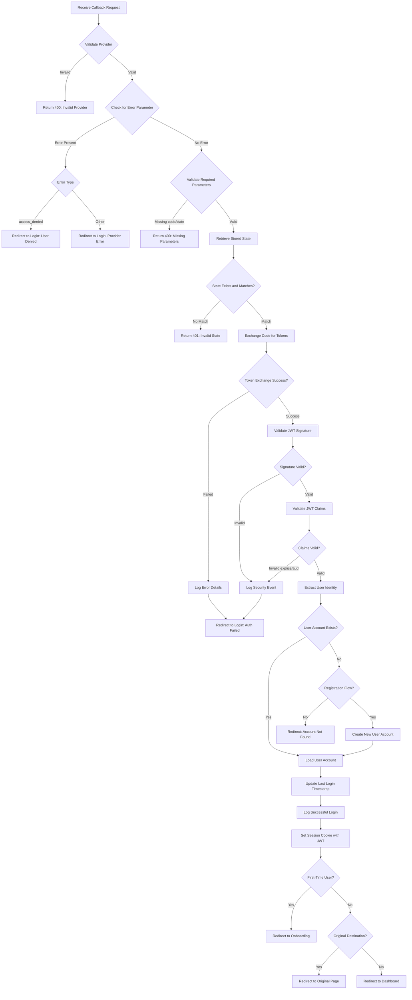

## API Overview

This endpoint handles the OAuth2/OIDC callback after a user has authenticated with an external identity provider (Google, Facebook, or Apple). When the provider redirects back to this endpoint with an authorization code, the system exchanges the code for access and ID tokens, validates the JWT, verifies or creates the user account, and establishes a session.

This endpoint is the second critical step in the SSO authentication flow as defined in ADR-0002 and ADR-0003. It completes the OAuth2 authorization code flow initiated by `GET /v1/auth/{provider}` and implements the stateless JWT session management strategy from ADR-0004.

## Endpoint Details

- **Method:** `GET`
- **Path:** `/v1/auth/{provider}/callback`
- **Content-Type:** N/A (redirects user)
- **Base URL:** `https://api.journeys.example.com` (update with actual base URL)

## Authentication

**Required:** No

This endpoint does not require prior authentication as it is the callback that establishes authentication. However, it validates the OAuth2 state parameter and authorization code to ensure the request is legitimate.

## Request

### Headers

| Header | Required | Description |
|--------|----------|-------------|
| `Cookie` | No | May contain state or session tracking cookies |
| `User-Agent` | No | Browser/client identifier for audit logging |

### Path Parameters

| Parameter | Type | Required | Description |
|-----------|------|----------|-------------|
| `provider` | string | Yes | OAuth2/OIDC provider identifier. Valid values: `google`, `facebook`, `apple` |

### Query Parameters

| Parameter | Type | Required | Description |
|-----------|------|----------|-------------|
| `code` | string | Yes | OAuth2 authorization code provided by the identity provider |
| `state` | string | Yes | State parameter for CSRF protection, must match the state from the initiation request |
| `error` | string | No | Error code if the provider rejected the authorization (e.g., `access_denied`) |
| `error_description` | string | No | Human-readable error description from the provider |

### Request Body

This endpoint does not accept a request body.

**Example:**

```
GET /v1/auth/google/callback?code=4/0AY0e-g7XYZ...&state=abc123
```

## Response

### Success Response (302 Found - Redirect)

The endpoint does not return JSON on success. Instead, it redirects the user to the application with a session established.

**Behavior:**
- Sets JWT token in httpOnly, secure, SameSite cookie
- Redirects to dashboard or originally requested page
- For first-time users, may redirect to onboarding flow

**Headers:**

```
HTTP/1.1 302 Found
Location: https://app.journeys.example.com/dashboard
Set-Cookie: session=eyJhbGc...; HttpOnly; Secure; SameSite=Lax; Path=/; Max-Age=86400
```

**Cookie Details:**

| Attribute | Value | Description |
|-----------|-------|-------------|
| `session` | JWT token | The validated JWT containing user identity and claims |
| `HttpOnly` | true | Prevents JavaScript access to prevent XSS attacks |
| `Secure` | true | Only sent over HTTPS connections |
| `SameSite` | Lax | CSRF protection while allowing navigation |
| `Path` | / | Cookie available for all application paths |
| `Max-Age` | 86400 (24h) | Token expiration time in seconds |

## Error Responses

### 302 Found - Redirect with Error

When authentication fails, the user is redirected to the login page with error information.

**Headers:**

```
HTTP/1.1 302 Found
Location: https://app.journeys.example.com/login?error=authentication_failed&reason=token_exchange_failed
```

**Error Query Parameters:**

| Parameter | Description |
|-----------|-------------|
| `error` | Error code (e.g., `authentication_failed`, `invalid_state`, `account_not_found`) |
| `reason` | Specific reason for the failure |

### 400 Bad Request

Invalid provider or missing required parameters.

```json
{
  "error": "invalid_request",
  "message": "Missing required parameter: code"
}
```

```json
{
  "error": "invalid_provider",
  "message": "Provider 'github' is not supported. Valid providers: google, facebook, apple"
}
```

### 401 Unauthorized

State validation failed (CSRF attack detected).

```json
{
  "error": "invalid_state",
  "message": "State parameter validation failed. Possible CSRF attack detected."
}
```

### 403 Forbidden

User denied authorization at the provider.

```json
{
  "error": "access_denied",
  "message": "User denied authorization. Please approve the requested permissions to continue."
}
```

### 500 Internal Server Error

Token exchange or internal processing failed.

```json
{
  "error": "internal_error",
  "message": "Failed to exchange authorization code. Please try again later."
}
```

## Business Logic Flow



### Flow Narrative

The OAuth2 callback flow begins when the identity provider redirects the user back to this endpoint after authentication:

1. **Provider Validation**: Verify the provider path parameter is supported (google, facebook, apple)

2. **Error Detection**: Check if the provider returned an error (user denial, provider issue). If so, redirect to login with appropriate messaging

3. **Parameter Validation**: Ensure required `code` and `state` parameters are present

4. **State Validation (CSRF Protection)**: Retrieve the stored state value (from cache/session) and compare with the received state. This prevents cross-site request forgery attacks. If state doesn't match, reject the request

5. **Token Exchange**: Exchange the authorization code for access and ID tokens by making a POST request to the provider's token endpoint with:
   - Authorization code
   - Client ID and client secret
   - Redirect URI (must match the original request)
   - Grant type: `authorization_code`

6. **JWT Validation**: Validate the ID token's JWT signature using the provider's JWKS (JSON Web Key Set):
   - Verify signature using provider's public key
   - Validate `exp` (expiration) claim
   - Validate `iss` (issuer) claim matches provider
   - Validate `aud` (audience) claim matches our client ID

7. **User Identity Extraction**: Extract user identifier from the JWT's `sub` (subject) claim and email from `email` claim

8. **Account Lookup**: Check if a user account exists with this provider identity:
   - **Registration Flow**: If this is a registration callback, create a new user account with provider identity, email, and profile data
   - **Login Flow**: If this is a login callback and no account exists, redirect to login with "account not found" error
   - **Account Found**: Load existing user account

9. **Session Establishment**: Create a stateless session per ADR-0004:
   - Use the validated JWT as the session token
   - Set JWT in httpOnly, secure, SameSite cookie
   - Set appropriate Max-Age based on token expiration

10. **Audit Logging**: Log successful authentication with timestamp, IP address, user agent, and provider used

11. **Redirect**: Send user to their destination:
    - First-time users → onboarding flow
    - Returning users with saved destination → original requested page
    - Default → dashboard

## Implementation Notes

- **State Management**: Store state parameters in a short-lived cache (Redis, in-memory) with 10-minute TTL. Include the original destination URL in the state data for post-login redirects.

- **PKCE Support**: If PKCE was used in the initial request, validate the `code_verifier` during token exchange. This is especially important for mobile apps and SPAs.

- **Token Exchange Security**:
  - Always use HTTPS for token exchange requests
  - Include client secret in POST body, not query parameters
  - Handle provider rate limits gracefully

- **JWT Validation**:
  - Cache provider JWKS with 24-hour TTL
  - Refresh JWKS on signature validation failures
  - Validate all required claims: `exp`, `iss`, `aud`, `sub`
  - Check optional `email_verified` claim if available

- **Account Matching**: Map provider identities to internal user IDs:
  - Format: `{provider}:{sub}` (e.g., `google:123456789`)
  - Support multiple provider identities per user for account linking

- **Cookie Security**:
  - Always set HttpOnly to prevent XSS access
  - Always set Secure flag (HTTPS-only)
  - Use SameSite=Lax for CSRF protection while allowing navigation
  - Set appropriate Max-Age based on JWT expiration

- **Rate Limiting**: Implement per-IP rate limiting (10 requests/minute) to prevent callback endpoint abuse

- **Error Logging**: Log detailed error information server-side but return generic messages to users to avoid leaking implementation details

- **Provider-Specific Handling**:
  - **Google**: Token endpoint requires client_secret in body
  - **Facebook**: May need additional Graph API call to get user email
  - **Apple**: Uses client_secret_jwt authentication method

- **Session Duration**: Default to 24-hour sessions. Consider implementing "remember me" for 30-day sessions.

## Related Documentation

- [ADR-0002: SSO Authentication Strategy](../adrs/0002-sso-authentication-strategy.md)
- [ADR-0003: OAuth2/OIDC Provider Selection](../adrs/0003-oauth2-oidc-provider-selection.md)
- [ADR-0004: Session Management](../adrs/0004-session-management.md)
- [API Documentation: GET /v1/auth/{provider}](v1-auth-provider-get.md) - OAuth initiation endpoint
- [User Journey 0001: User Registration](../user-journeys/0001-user-registration.md)
- [User Journey 0002: User Login via SSO](../user-journeys/0002-user-login-via-sso.md)

## Examples

### Example 1: Successful Google Authentication

**Request:**

```bash
GET /v1/auth/google/callback?code=4/0AY0e-g7XYZ123abc...&state=random_state_123
```

**Response:**

```
HTTP/1.1 302 Found
Location: https://app.journeys.example.com/dashboard
Set-Cookie: session=eyJhbGciOiJSUzI1NiIsInR5cCI6IkpXVCJ9...; HttpOnly; Secure; SameSite=Lax; Path=/; Max-Age=86400
```

### Example 2: First-Time User Registration

**Request:**

```bash
GET /v1/auth/apple/callback?code=c12345abcdef...&state=registration_xyz_789
```

**Response:**

```
HTTP/1.1 302 Found
Location: https://app.journeys.example.com/onboarding
Set-Cookie: session=eyJhbGciOiJSUzI1NiIsInR5cCI6IkpXVCJ9...; HttpOnly; Secure; SameSite=Lax; Path=/; Max-Age=86400
```

### Example 3: User Denied Authorization

**Request:**

```bash
GET /v1/auth/facebook/callback?error=access_denied&error_description=User+denied+permission&state=login_abc_456
```

**Response:**

```
HTTP/1.1 302 Found
Location: https://app.journeys.example.com/login?error=access_denied&reason=user_denied_permission
```

### Example 4: Invalid State (CSRF Attack)

**Request:**

```bash
GET /v1/auth/google/callback?code=4/0AY0e-g7...&state=invalid_state_999
```

**Response:**

```json
HTTP/1.1 401 Unauthorized
Content-Type: application/json

{
  "error": "invalid_state",
  "message": "State parameter validation failed. Possible CSRF attack detected."
}
```

### Example 5: Account Not Found During Login

**Request:**

```bash
GET /v1/auth/google/callback?code=4/0AY0e-g7...&state=login_state_abc
```

**Internal Processing:**
- Token exchange succeeds
- JWT validation passes
- User ID extracted: `google:999888777`
- Account lookup: No matching account found

**Response:**

```
HTTP/1.1 302 Found
Location: https://app.journeys.example.com/login?error=account_not_found&reason=no_account_for_provider
```

### Example 6: Deep Link After Login

**Request:**

```bash
GET /v1/auth/google/callback?code=4/0AY0e-g7...&state=deeplink_journey_123
```

**Internal Processing:**
- State data contains original destination: `/journeys/550e8400-e29b-41d4-a716-446655440000`
- Authentication succeeds

**Response:**

```
HTTP/1.1 302 Found
Location: https://app.journeys.example.com/journeys/550e8400-e29b-41d4-a716-446655440000
Set-Cookie: session=eyJhbGciOiJSUzI1NiIsInR5cCI6IkpXVCJ9...; HttpOnly; Secure; SameSite=Lax; Path=/; Max-Age=86400
```

## Changelog

| Date | Version | Changes |
|------|---------|---------|
| 2025-10-27 | 1.0 | Initial API documentation |
