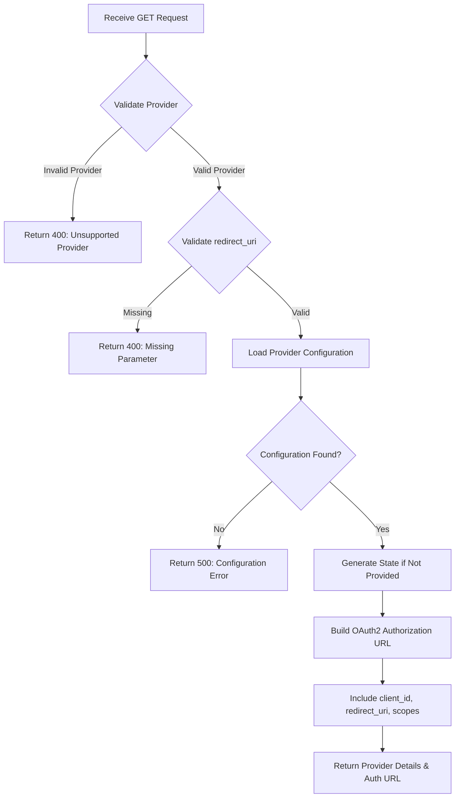

## API Overview

This endpoint returns authentication provider details and initiates the OAuth2/OIDC authentication flow for the specified provider. When called, it provides the OAuth2 authorization URL and necessary configuration for the client to redirect the user to the external identity provider (Google, Facebook, or Apple) for authentication.

This endpoint is the first step in the SSO authentication flow as defined in ADR-0002 and ADR-0003. It enables users to authenticate using their existing accounts with supported OAuth2/OIDC providers rather than managing passwords within the Journeys application.

## Endpoint Details

- **Method:** `GET`
- **Path:** `/v1/auth/{provider}`
- **Content-Type:** `application/json`
- **Base URL:** `https://api.journeys.example.com` (update with actual base URL)

## Authentication

**Required:** No

This endpoint does not require authentication as it is used to initiate the authentication process. It is a public endpoint that provides the necessary information for users to begin the OAuth2/OIDC flow.

## Request

### Headers

| Header | Required | Description |
|--------|----------|-------------|
| `Accept` | No | Should be `application/json` for JSON response |

### Path Parameters

| Parameter | Type | Required | Description |
|-----------|------|----------|-------------|
| `provider` | string | Yes | OAuth2/OIDC provider identifier. Valid values: `google`, `facebook`, `apple` |

### Query Parameters

| Parameter | Type | Required | Description |
|-----------|------|----------|-------------|
| `redirect_uri` | string | Yes | The callback URI where the user will be redirected after authentication |
| `state` | string | No | Opaque value used to maintain state between request and callback (recommended for CSRF protection) |

### Request Body

This endpoint does not accept a request body.

**Example:**

```
GET /v1/auth/google?redirect_uri=https://app.journeys.example.com/callback&state=abc123
```

## Response

### Success Response (200 OK)

**Schema:**

```json
{
  "provider": "string",
  "authorizationUrl": "string",
  "clientId": "string",
  "scopes": ["array", "of", "strings"],
  "responseType": "string",
  "state": "string"
}
```

**Field Descriptions:**

| Field | Type | Description |
|-------|------|-------------|
| `provider` | string | The OAuth2/OIDC provider identifier (e.g., "google", "facebook", "apple") |
| `authorizationUrl` | string | The complete OAuth2 authorization URL where the user should be redirected |
| `clientId` | string | The OAuth2 client ID for this provider |
| `scopes` | array[string] | List of OAuth2 scopes requested for this authentication |
| `responseType` | string | OAuth2 response type (typically "code" for authorization code flow) |
| `state` | string | The state parameter echoed back or generated by the server |

**Example:**

```json
{
  "provider": "google",
  "authorizationUrl": "https://accounts.google.com/o/oauth2/v2/auth?client_id=123456.apps.googleusercontent.com&redirect_uri=https://app.journeys.example.com/callback&response_type=code&scope=openid%20profile%20email&state=abc123",
  "clientId": "123456.apps.googleusercontent.com",
  "scopes": ["openid", "profile", "email"],
  "responseType": "code",
  "state": "abc123"
}
```

## Error Responses

### 400 Bad Request

Invalid provider specified or missing required query parameters.

```json
{
  "error": "invalid_provider",
  "message": "Provider 'github' is not supported. Valid providers: google, facebook, apple"
}
```

```json
{
  "error": "missing_parameter",
  "message": "Required query parameter 'redirect_uri' is missing"
}
```

### 500 Internal Server Error

An unexpected error occurred on the server.

```json
{
  "error": "internal_error",
  "message": "Failed to generate authorization URL. Please try again later."
}
```

## Business Logic Flow

Use Mermaid syntax to create a flowchart representing the business logic:



The business logic flow works as follows:

1. **Validate Provider**: Check that the provider path parameter matches one of the supported OAuth2/OIDC providers (google, facebook, apple) as defined in ADR-0003
2. **Validate redirect_uri**: Ensure the required `redirect_uri` query parameter is present
3. **Load Provider Configuration**: Retrieve the OAuth2/OIDC configuration for the specified provider (client ID, client secret, scopes, endpoints)
4. **Generate State**: If the client didn't provide a `state` parameter, generate a random state value for CSRF protection
5. **Build Authorization URL**: Construct the complete OAuth2 authorization URL with all required parameters
6. **Return Details**: Send back the provider details and authorization URL to the client

## Implementation Notes

- **Supported Providers**: As per ADR-0003, only Google, Facebook, and Apple are supported. Any other provider should return a 400 error.
- **State Parameter**: While the `state` parameter is optional in the request, it is highly recommended for CSRF protection. If not provided, the server should generate one.
- **redirect_uri Validation**: The server should validate that the `redirect_uri` matches one of the pre-configured allowed callback URIs to prevent open redirect vulnerabilities.
- **Scopes**: Each provider has different required scopes:
  - Google: `openid`, `profile`, `email`
  - Facebook: `public_profile`, `email`
  - Apple: `name`, `email`
- **Client Configuration**: OAuth2 client credentials (client ID and secret) should be securely stored in configuration, not hardcoded.
- **No Rate Limiting**: This endpoint is public and used to initiate authentication, but consider implementing rate limiting to prevent abuse.
- **PKCE Support**: For enhanced security with mobile/SPA clients, consider supporting PKCE (Proof Key for Code Exchange) extension.

## Related Documentation

- [ADR-0002: SSO Authentication Strategy](../adrs/0002-sso-authentication-strategy.md) - OAuth2/OIDC authentication decision
- [ADR-0003: OAuth2/OIDC Provider Selection](../adrs/0003-oauth2-oidc-provider-selection.md) - Supported provider selection
- [User Journey 0001: User Login via SSO](../user-journeys/0001-user-login-via-sso.md) - Complete authentication flow
- [Analysis: Keycloak](../analysis/open-source/keycloak.md) - Alternative OIDC provider solution

## Examples

### Example 1: Initiate Google Authentication

**Request:**

```bash
curl -X GET "https://api.journeys.example.com/v1/auth/google?redirect_uri=https://app.journeys.example.com/callback&state=random_state_123" \
  -H "Accept: application/json"
```

**Response:**

```json
{
  "provider": "google",
  "authorizationUrl": "https://accounts.google.com/o/oauth2/v2/auth?client_id=123456.apps.googleusercontent.com&redirect_uri=https://app.journeys.example.com/callback&response_type=code&scope=openid%20profile%20email&state=random_state_123",
  "clientId": "123456.apps.googleusercontent.com",
  "scopes": ["openid", "profile", "email"],
  "responseType": "code",
  "state": "random_state_123"
}
```

### Example 2: Initiate Apple Authentication

**Request:**

```bash
curl -X GET "https://api.journeys.example.com/v1/auth/apple?redirect_uri=https://app.journeys.example.com/callback" \
  -H "Accept: application/json"
```

**Response:**

```json
{
  "provider": "apple",
  "authorizationUrl": "https://appleid.apple.com/auth/authorize?client_id=com.example.journeys&redirect_uri=https://app.journeys.example.com/callback&response_type=code&scope=name%20email&state=generated_state_xyz",
  "clientId": "com.example.journeys",
  "scopes": ["name", "email"],
  "responseType": "code",
  "state": "generated_state_xyz"
}
```

### Example 3: Invalid Provider Error

**Request:**

```bash
curl -X GET "https://api.journeys.example.com/v1/auth/github?redirect_uri=https://app.journeys.example.com/callback" \
  -H "Accept: application/json"
```

**Response:**

```json
{
  "error": "invalid_provider",
  "message": "Provider 'github' is not supported. Valid providers: google, facebook, apple"
}
```

## Changelog

| Date | Version | Changes |
|------|---------|---------|
| 2025-10-26 | 1.0 | Initial API documentation |
