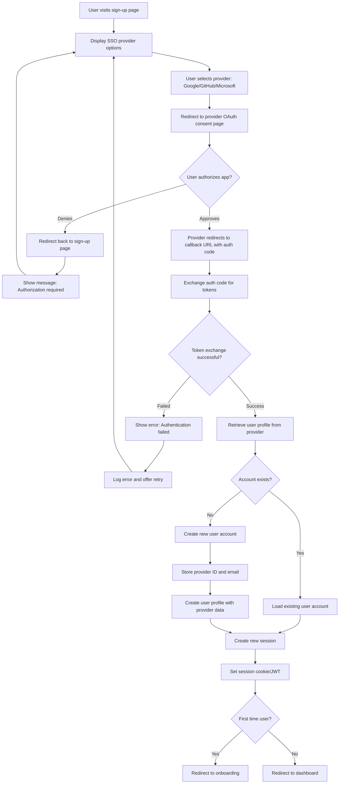

## Overview

This user journey describes the process by which a new user creates an account in the journey tracking system using Single Sign-On (SSO) with third-party identity providers. The registration flow leverages existing OAuth2/OIDC providers (such as Google, GitHub, Microsoft) to eliminate password management burden and streamline the authentication process. The user persona is anyone who wants to track their personal or professional journeys, ranging from individuals to small teams.

The business value of an SSO-based registration process includes:
- Eliminating friction by removing password creation and management
- Leveraging trusted identity providers for enhanced security
- Reducing development and maintenance costs for authentication infrastructure
- Providing immediate access without email verification steps
- Enabling future social and collaboration features through provider integrations

## Journey Flow Diagram

Use Mermaid syntax to create a flowchart representing the user journey:

### Flow Narrative

The user registration journey begins when a user visits the sign-up page. Instead of entering credentials, the user is presented with SSO provider options (Google, GitHub, Microsoft). The user selects their preferred identity provider.

Upon selection, the application redirects the user to the chosen provider's OAuth2/OIDC consent page. The user reviews the requested permissions and either approves or denies the authorization request.

If the user denies authorization, they are redirected back to the sign-up page with a message explaining that authorization is required to proceed. They can then choose a different provider or retry with the same one.

If the user approves authorization, the provider redirects back to the application's callback URL with an authorization code. The application exchanges this code for access and ID tokens from the provider. If the token exchange fails (due to network issues, invalid codes, or provider errors), the user sees an error message and can retry.

Upon successful token exchange, the application retrieves the user's profile information (email, name, profile picture) from the provider. The system then checks if an account already exists for this provider identity.

If an existing account is found, the user is logged in and a new session is created. If no account exists, a new user account is created with the provider's identity information and profile data. In both cases, a session is established using cookies or JWT tokens.

Finally, the application determines if this is the user's first visit. New users are redirected to an onboarding flow to complete their profile or learn about the platform, while returning users proceed directly to their dashboard.

## Technical Requirements

### Access Control

#### REQ-AC-001
- **Priority**: P0
- **Description**: Support OAuth2/OIDC authentication with multiple identity providers (Google, GitHub, Microsoft as initial set)
- **Rationale**: Enables SSO-based registration and authentication without managing user credentials

#### REQ-AC-002
- **Priority**: P0
- **Description**: Validate provider email addresses are verified before account creation
- **Rationale**: Ensures email ownership through trusted identity providers

#### REQ-AC-003
- **Priority**: P0
- **Description**: Store provider-specific user identifiers (subject ID) and link to internal user accounts
- **Rationale**: Enables proper account matching across logins and prevents duplicate accounts

#### REQ-AC-004
- **Priority**: P1
- **Description**: Support multiple identity providers per user account via explicit user-initiated linking (see [ADR-0005](../adrs/0005-account-linking.md))
- **Rationale**: Allows users to sign in with different providers to the same account. Implementation uses explicit user-initiated linking (not automatic) to prevent unauthorized account takeover while giving users full control. See [User Journey 0003](0003-account-linking.md) for detailed flows.

#### REQ-AC-005
- **Priority**: P2
- **Description**: Implement session timeout and refresh token rotation for enhanced security
- **Rationale**: Limits exposure from compromised tokens and aligns with OAuth2 best practices

### Rate Limits

#### REQ-RL-001
- **Priority**: P0
- **Description**: Limit OAuth callback requests to 10 per IP address per minute
- **Rationale**: Prevents callback endpoint abuse and replay attacks

#### REQ-RL-002
- **Priority**: P1
- **Description**: Limit authentication initiation requests to 5 per IP address per minute per provider
- **Rationale**: Prevents automated abuse of OAuth flows and provider API quotas

#### REQ-RL-003
- **Priority**: P2
- **Description**: Implement exponential backoff for repeated failed OAuth exchanges from the same session
- **Rationale**: Protects against brute force attacks and reduces load on provider APIs

### Analytics

#### REQ-AN-001
- **Priority**: P1
- **Description**: Track SSO registration funnel metrics: sign-up page visits, provider selections, authorization approvals/denials, successful registrations, provider-specific conversion rates
- **Rationale**: Enables optimization of provider options and identification of drop-off points in the OAuth flow

#### REQ-AN-002
- **Priority**: P1
- **Description**: Track OAuth flow failures with categorization: token exchange errors, provider API errors, network timeouts
- **Rationale**: Helps identify integration issues and provider reliability problems

#### REQ-AN-003
- **Priority**: P2
- **Description**: Track time-to-complete metric (time between initial provider selection and successful account creation)
- **Rationale**: Measures overall flow efficiency and user experience quality

### Data Storage

#### REQ-DS-001
- **Priority**: P0
- **Description**: Store OAuth provider identifiers (provider name, subject/user ID) linked to user accounts
- **Rationale**: Enables account matching across logins and prevents duplicate accounts

#### REQ-DS-002
- **Priority**: P0
- **Description**: Store user profile data from providers (email, name, profile picture URL) at account creation
- **Rationale**: Provides initial user profile information without additional data collection

#### REQ-DS-003
- **Priority**: P0
- **Description**: Store OAuth state parameters with expiration (10-minute validity) to prevent CSRF attacks
- **Rationale**: Security best practice for OAuth flows to prevent cross-site request forgery

#### REQ-DS-004
- **Priority**: P1
- **Description**: Store refresh tokens securely (encrypted at rest) for maintaining user sessions
- **Rationale**: Enables long-lived sessions while maintaining security and ability to revoke access

#### REQ-DS-005
- **Priority**: P1
- **Description**: Store registration metadata: IP address, user agent, provider used, registration timestamp
- **Rationale**: Enables security analysis, fraud detection, and understanding provider preferences

#### REQ-DS-006
- **Priority**: P2
- **Description**: Implement soft deletion for user accounts to maintain referential integrity
- **Rationale**: Allows account recovery and preserves audit trails

#### REQ-DS-007
- **Priority**: P2
- **Description**: Cache provider discovery documents and JWKS with appropriate TTL
- **Rationale**: Improves performance and reduces dependency on provider availability for routine operations

### Other Requirements

#### REQ-OT-001
- **Priority**: P0
- **Description**: Implement PKCE (Proof Key for Code Exchange) for all OAuth flows
- **Rationale**: Enhanced security for public clients and protection against authorization code interception attacks

#### REQ-OT-002
- **Priority**: P0
- **Description**: Validate ID token signatures using provider JWKS before trusting claims
- **Rationale**: Ensures authenticity of tokens and prevents token forgery

#### REQ-OT-003
- **Priority**: P0
- **Description**: Securely store OAuth client secrets (encrypted at rest, not in version control)
- **Rationale**: Prevents unauthorized applications from impersonating the service

#### REQ-OT-004
- **Priority**: P1
- **Description**: Implement proper redirect URI validation with exact match against registered URIs
- **Rationale**: Prevents open redirect vulnerabilities and authorization code theft

#### REQ-OT-005
- **Priority**: P1
- **Description**: Handle provider-specific error scenarios gracefully with user-friendly messages
- **Rationale**: Improves user experience when providers are unavailable or return errors

#### REQ-OT-006
- **Priority**: P1
- **Description**: Request minimal OAuth scopes necessary (email, profile) from providers
- **Rationale**: Follows principle of least privilege and improves user trust

#### REQ-OT-007
- **Priority**: P2
- **Description**: Support dynamic provider configuration to add new providers without code changes
- **Rationale**: Enables easier expansion to additional identity providers

#### REQ-OT-008
- **Priority**: P2
- **Description**: Implement provider health checks and gracefully disable unavailable providers
- **Rationale**: Prevents user frustration with broken provider options and improves reliability

## Success Metrics

Success for the SSO-based user registration journey will be measured through the following metrics:

- **SSO Authorization Approval Rate**: Target 85%+ of users who initiate OAuth flow approve authorization (measures user trust and scope clarity)
- **Registration Completion Rate**: Target 90%+ of users who approve authorization successfully complete registration (measures OAuth integration reliability)
- **Time to Complete Registration**: Target median time under 60 seconds from provider selection to account creation (measures flow efficiency)
- **Provider Distribution**: Track percentage of registrations per provider to optimize provider offerings and prioritize integration efforts
- **OAuth Error Rate**: Target less than 2% of OAuth flows result in errors (measures integration quality and provider reliability)
- **Support Tickets Related to Registration**: Baseline metric to track over time (measures overall process clarity and provider-specific issues)

## Related Documentation

- [ADR-0002: SSO Authentication Strategy](../adrs/0002-sso-authentication-strategy.md)
- [ADR-0003: OAuth2/OIDC Provider Selection](../adrs/0003-oauth2-oidc-provider-selection.md)
- [ADR-0004: Session Management](../adrs/0004-session-management.md)
- [ADR-0005: Account Linking Strategy](../adrs/0005-account-linking.md)
- [API Documentation: GET /v1/auth/{provider}](../apis/v1-auth-provider-get.md)
- [API Documentation: GET /v1/auth/{provider}/callback](../apis/v1-auth-provider-callback-get.md)
- [User Journey: User Login via SSO](0002-user-login-via-sso.md)
- [User Journey: Account Linking](0003-account-linking.md)

## Notes

- **Provider Selection**: Start with Google, GitHub, and Microsoft as they are widely used and have robust OAuth2/OIDC implementations. Consider adding more providers based on user demand.
- **PKCE Implementation**: While PKCE is primarily designed for public clients (mobile/SPA), implementing it for all flows provides defense-in-depth security.
- **Error Handling**: Provide clear, user-friendly error messages that don't expose sensitive implementation details. Log detailed errors server-side for debugging.
- **Provider API Quotas**: Monitor API usage against provider quotas. Most providers offer generous free tiers but have limits on requests per second.
- **GDPR Compliance**: Ensure proper consent for data collection during registration. Store only necessary profile data from providers.
- **Email Verification**: While SSO providers verify emails, verify the `email_verified` claim in ID tokens before trusting email addresses.
- **Account Linking Strategy**: [ADR-0005](../adrs/0005-account-linking.md) has decided on explicit user-initiated linking only (not automatic linking). Linking flows are documented in [User Journey 0003](0003-account-linking.md).
- **Fallback Authentication**: Consider if a fallback authentication method (email/password) is needed for users who can't or won't use SSO providers.
- **Testing**: Implement comprehensive OAuth flow testing including error scenarios, expired tokens, and provider outages.
- **Future Considerations**:
  - Add optional profile fields (organization, role) during or after registration
  - Implement referral tracking to measure acquisition channels
  - Support enterprise SSO providers (SAML, custom OIDC)
  - Consider magic link authentication as alternative to traditional SSO
