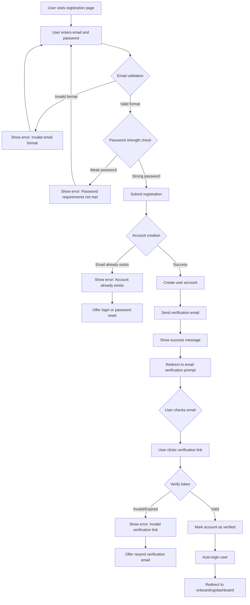

## Overview

This user journey describes the process by which a new user creates an account in the journey tracking system. The registration flow must be simple, secure, and compliant with modern authentication best practices. The user persona is anyone who wants to track their personal or professional journeys, ranging from individuals to small teams.

The business value of a streamlined registration process includes:
- Reducing friction for new user acquisition
- Establishing trust through secure authentication
- Collecting necessary data for personalized experiences
- Enabling future social and collaboration features

## Journey Flow Diagram

Use Mermaid syntax to create a flowchart representing the user journey:

### Flow Narrative

The user registration journey begins when a user visits the registration page. The user provides their email address and creates a password. The system validates the email format in real-time and checks password strength against defined requirements (e.g., minimum length, complexity).

If validation fails, the user receives clear error messages and can correct their input. Once valid credentials are provided, the system attempts to create the account.

If the email is already registered, the system informs the user and offers options to log in or reset their password. If the registration succeeds, the system creates the user account, sends a verification email, and displays a success message prompting the user to check their email.

The user clicks the verification link in their email, which validates the token. If the token is valid, the account is marked as verified, the user is automatically logged in, and redirected to the onboarding flow or main dashboard. If the token is invalid or expired, the user can request a new verification email.

## Technical Requirements

### Access Control

#### REQ-AC-001
- **Priority**: P0
- **Description**: New accounts must be created in an unverified state and cannot access protected resources until email verification is complete
- **Rationale**: Ensures email ownership and prevents spam/bot registrations

#### REQ-AC-002
- **Priority**: P1
- **Description**: Implement account lockout after 5 failed registration attempts from the same IP within 15 minutes
- **Rationale**: Prevents automated abuse and enumeration attacks

#### REQ-AC-003
- **Priority**: P2
- **Description**: Support OAuth2 registration with third-party providers (Google, GitHub)
- **Rationale**: Improves user convenience and reduces password management burden

### Rate Limits

#### REQ-RL-001
- **Priority**: P0
- **Description**: Limit registration attempts to 3 per IP address per hour
- **Rationale**: Prevents automated bot registrations and abuse

#### REQ-RL-002
- **Priority**: P1
- **Description**: Limit verification email resend to 3 requests per account per day
- **Rationale**: Prevents email spam and abuse of the email service

### Analytics

#### REQ-AN-001
- **Priority**: P1
- **Description**: Track registration funnel metrics: page visits, form submissions, validation errors, successful registrations, verification completions
- **Rationale**: Enables optimization of the registration flow and identification of drop-off points

#### REQ-AN-002
- **Priority**: P2
- **Description**: Track time-to-verify metric (time between registration and email verification)
- **Rationale**: Helps identify issues with email delivery or user engagement

### Data Storage

#### REQ-DS-001
- **Priority**: P0
- **Description**: Store user credentials with bcrypt password hashing (cost factor 12+)
- **Rationale**: Industry standard for secure password storage

#### REQ-DS-002
- **Priority**: P0
- **Description**: Store email addresses in lowercase and validate uniqueness case-insensitively
- **Rationale**: Prevents duplicate accounts with different email casing

#### REQ-DS-003
- **Priority**: P0
- **Description**: Store verification tokens with expiration timestamps (24-hour validity)
- **Rationale**: Enables time-limited verification and token cleanup

#### REQ-DS-004
- **Priority**: P1
- **Description**: Store registration metadata: IP address, user agent, registration timestamp
- **Rationale**: Enables security analysis and fraud detection

#### REQ-DS-005
- **Priority**: P2
- **Description**: Implement soft deletion for user accounts to maintain referential integrity
- **Rationale**: Allows account recovery and preserves audit trails

### Other Requirements

#### REQ-OT-001
- **Priority**: P0
- **Description**: Password must meet minimum requirements: 8+ characters, at least one uppercase, one lowercase, one number
- **Rationale**: Ensures baseline password security

#### REQ-OT-002
- **Priority**: P0
- **Description**: Verification emails must be sent within 30 seconds of registration
- **Rationale**: Ensures good user experience and immediate engagement

#### REQ-OT-003
- **Priority**: P1
- **Description**: Implement CAPTCHA or similar challenge on registration form after failed attempts
- **Rationale**: Additional bot protection without impacting legitimate users

#### REQ-OT-004
- **Priority**: P1
- **Description**: Registration API must return generic errors for existing emails to prevent email enumeration
- **Rationale**: Prevents attackers from determining which emails are registered

#### REQ-OT-005
- **Priority**: P2
- **Description**: Support customizable password policies per deployment
- **Rationale**: Allows organizations to enforce their own security requirements

## Success Metrics

Success for the user registration journey will be measured through the following metrics:

- **Registration Completion Rate**: Target 70%+ of users who start the form complete registration (measures form UX quality)
- **Email Verification Rate**: Target 85%+ of registered users verify their email within 24 hours (measures email deliverability and user engagement)
- **Time to First Verification**: Target median time under 5 minutes (measures user eagerness and email delivery speed)
- **Registration Error Rate**: Target less than 10% of submissions result in validation errors (measures form clarity and validation UX)
- **Support Tickets Related to Registration**: Baseline metric to track over time (measures overall process clarity)

## Related Documentation

- [ADR-XXXX: Authentication Strategy] (to be created)
- [ADR-XXXX: Password Policy] (to be created)
- [API Documentation: POST /v1/users/register] (to be created)
- [API Documentation: POST /v1/users/verify] (to be created)
- [User Journey: User Login] (to be created)
- [User Journey: Password Reset] (to be created)

## Notes

- Consider implementing progressive enhancement for real-time validation to support users without JavaScript
- Ensure verification emails have clear branding and are mobile-friendly
- Plan for internationalization (i18n) of error messages and email templates
- Consider GDPR compliance requirements for data collection during registration
- Future consideration: Add optional profile fields (name, organization) during or after registration
- Future consideration: Implement referral tracking to measure acquisition channels
