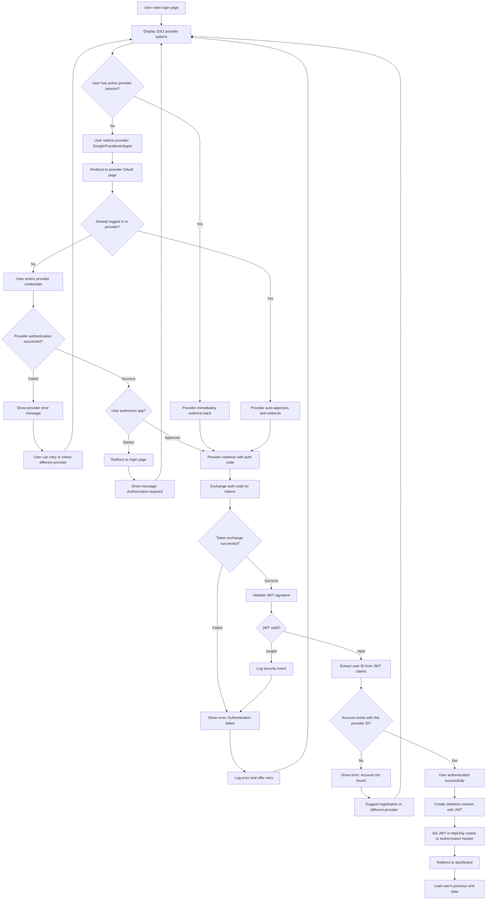

## Overview

This user journey describes the process by which a returning user authenticates to access the journey tracking system using Single Sign-On (SSO) with third-party OAuth2/OIDC identity providers (Google, Facebook, Apple). Unlike the registration flow, this journey assumes the user already has an account and is returning to access their existing journeys and data. The login flow leverages the same OAuth2/OIDC infrastructure established during registration, providing a seamless authentication experience.

The business value of the SSO-based login process includes:
- Consistent authentication experience across registration and login flows
- Elimination of password-based authentication vulnerabilities
- Leveraging provider-managed security features (MFA, security keys, etc.)
- Faster login experience through provider session persistence
- Reduced support burden for password resets and account recovery
- Improved security through stateless JWT-based session management

## Journey Flow Diagram

### Flow Narrative

The user login journey begins when a returning user visits the login page. The system displays available SSO provider options (Google, Facebook, Apple) that the user can authenticate with.

**Fast Path - Active Provider Session:**
If the user has an active session with their chosen provider (they're already logged into Google/Facebook/Apple in their browser), the OAuth flow can complete almost immediately. The provider recognizes the active session and auto-approves the authorization request, redirecting back to the application with minimal user interaction.

**Standard Path - No Active Provider Session:**
If the user doesn't have an active provider session, they select their preferred identity provider and are redirected to that provider's OAuth authentication page. If they're not logged into the provider, they enter their credentials. The provider validates the credentials and, upon success, prompts for authorization (unless previously granted with "remember" option).

**Authorization:**
The user reviews the requested permissions and either approves or denies. If denied, they're redirected back to the login page with a message explaining authorization is required. If approved, the provider redirects back with an authorization code.

**Token Exchange and Validation:**
The application exchanges the authorization code for access and ID tokens. If the exchange fails (network issues, invalid codes, provider errors), an error is shown with retry options. Upon successful exchange, the application validates the JWT token's signature using the provider's JWKS (JSON Web Key Set) to ensure authenticity.

**Account Verification:**
The application extracts the user identifier from the JWT's `sub` (subject) claim and checks if an account exists with this provider identity. If no matching account is found, the user is informed and directed to either register a new account or try a different provider (in case they registered with a different provider).

**Session Creation:**
Once the account is verified, the application creates a stateless session by setting the validated JWT token in an httpOnly, secure cookie (for web) or returning it for client storage (for mobile apps). No server-side session storage is required (ADR-0004: Stateless JWT approach).

**Dashboard Access:**
The user is redirected to their dashboard, where the application uses the JWT to authorize requests and load the user's journeys and associated data.

## Technical Requirements

### Access Control

#### REQ-AC-001
- **Priority**: P0
- **Description**: Support OAuth2/OIDC authentication with Google, Facebook, and Apple identity providers
- **Rationale**: Enables SSO-based login consistent with registration flow and ADR-0003 decision

#### REQ-AC-002
- **Priority**: P0
- **Description**: Validate JWT token signatures using provider JWKS before trusting claims
- **Rationale**: Ensures token authenticity and prevents token forgery attacks

#### REQ-AC-003
- **Priority**: P0
- **Description**: Verify JWT token expiration (exp claim) on every authenticated request
- **Rationale**: Prevents use of expired tokens and enforces proper session timeouts

#### REQ-AC-004
- **Priority**: P0
- **Description**: Match provider user identifier (sub claim) to existing user accounts
- **Rationale**: Ensures correct user is authenticated and prevents account confusion

#### REQ-AC-005
- **Priority**: P1
- **Description**: Implement "remember me" functionality that influences token expiration duration
- **Rationale**: Balances user convenience with security for different use cases

#### REQ-AC-006
- **Priority**: P1
- **Description**: Support PKCE (Proof Key for Code Exchange) in OAuth flow for enhanced security
- **Rationale**: Protects against authorization code interception attacks, especially for mobile apps

#### REQ-AC-007
- **Priority**: P2
- **Description**: Track last login timestamp and display to user for security awareness
- **Rationale**: Helps users identify unauthorized access to their accounts

### Rate Limits

#### REQ-RL-001
- **Priority**: P0
- **Description**: Limit OAuth callback requests to 10 per IP address per minute
- **Rationale**: Prevents callback endpoint abuse and replay attacks

#### REQ-RL-002
- **Priority**: P1
- **Description**: Limit authentication initiation requests to 5 per IP per minute per provider
- **Rationale**: Prevents automated abuse of OAuth flows and provider API quota consumption

#### REQ-RL-003
- **Priority**: P1
- **Description**: Implement account-level rate limiting (10 login attempts per hour per account)
- **Rationale**: Protects individual accounts from credential stuffing and brute force attempts

#### REQ-RL-004
- **Priority**: P2
- **Description**: Implement exponential backoff for repeated failed login attempts from same session
- **Rationale**: Reduces effectiveness of automated attacks while allowing legitimate retry

### Analytics

#### REQ-AN-001
- **Priority**: P1
- **Description**: Track login funnel metrics: login page visits, provider selections, authentication attempts, successful logins, provider-specific success rates
- **Rationale**: Enables optimization of provider options and identification of authentication issues

#### REQ-AN-002
- **Priority**: P1
- **Description**: Track OAuth flow failures with categorization: token exchange errors, JWT validation failures, account not found, provider API errors
- **Rationale**: Helps identify integration issues, security events, and provider reliability problems

#### REQ-AN-003
- **Priority**: P1
- **Description**: Track time-to-login metric (time from provider selection to dashboard load)
- **Rationale**: Measures authentication performance and user experience quality

#### REQ-AN-004
- **Priority**: P2
- **Description**: Track provider session reuse rate (immediate redirects vs. full authentication)
- **Rationale**: Measures effectiveness of provider session persistence and user convenience

#### REQ-AN-005
- **Priority**: P2
- **Description**: Track device and browser diversity per user for security monitoring
- **Rationale**: Helps identify potentially compromised accounts accessing from unusual locations/devices

### Data Storage

#### REQ-DS-001
- **Priority**: P0
- **Description**: Store OAuth state parameters with 10-minute expiration to prevent CSRF attacks
- **Rationale**: Security best practice for OAuth flows to prevent cross-site request forgery

#### REQ-DS-002
- **Priority**: P0
- **Description**: Cache provider JWKS (JSON Web Key Sets) with appropriate TTL (24 hours)
- **Rationale**: Improves JWT validation performance and reduces dependency on provider availability

#### REQ-DS-003
- **Priority**: P0
- **Description**: Store JWT tokens in httpOnly, secure, SameSite cookies for web applications
- **Rationale**: Prevents XSS attacks from accessing tokens while enabling automatic token submission

#### REQ-DS-004
- **Priority**: P1
- **Description**: Store login audit log: timestamp, IP address, user agent, provider used, success/failure
- **Rationale**: Enables security analysis, fraud detection, and user account activity review

#### REQ-DS-005
- **Priority**: P2
- **Description**: Cache provider discovery documents with appropriate TTL (1 hour)
- **Rationale**: Improves performance and reduces dependency on provider availability for OAuth metadata

### Other Requirements

#### REQ-OT-001
- **Priority**: P0
- **Description**: Implement proper OAuth state validation to prevent CSRF attacks
- **Rationale**: Critical security requirement to ensure OAuth flow integrity

#### REQ-OT-002
- **Priority**: P0
- **Description**: Validate redirect URIs with exact match against registered URIs
- **Rationale**: Prevents open redirect vulnerabilities and authorization code theft

#### REQ-OT-003
- **Priority**: P0
- **Description**: Implement JWT signature validation using provider's public keys (JWKS)
- **Rationale**: Ensures token authenticity and prevents token forgery

#### REQ-OT-004
- **Priority**: P0
- **Description**: Handle JWT token expiration gracefully with clear messaging to user
- **Rationale**: Good user experience when tokens expire during session

#### REQ-OT-005
- **Priority**: P1
- **Description**: Support deep linking - redirect to originally requested page after login
- **Rationale**: Improves user experience by returning users to their intended destination

#### REQ-OT-006
- **Priority**: P1
- **Description**: Implement graceful handling of provider outages (clear error messages, retry options)
- **Rationale**: Maintains good user experience when external dependencies fail

#### REQ-OT-007
- **Priority**: P1
- **Description**: Provide option to "Sign in with a different account" during OAuth flow
- **Rationale**: Allows users to switch provider accounts if they have multiple

#### REQ-OT-008
- **Priority**: P2
- **Description**: Display provider-specific icons and branding on login buttons
- **Rationale**: Improves recognition and trust through familiar provider branding

#### REQ-OT-009
- **Priority**: P2
- **Description**: Implement "Sign out everywhere" functionality that invalidates all user sessions
- **Rationale**: Security feature for compromised accounts (note: challenging with stateless JWT)

#### REQ-OT-010
- **Priority**: P2
- **Description**: Support account linking workflow for users who registered with different provider
- **Rationale**: Helps users who forget which provider they used for registration

## Success Metrics

Success for the SSO-based user login journey will be measured through the following metrics:

- **Login Success Rate**: Target 95%+ of login attempts result in successful authentication (measures OAuth integration reliability and account matching accuracy)
- **Time to Login**: Target median time under 30 seconds from provider selection to dashboard load (measures authentication performance and provider response times)
- **Provider Session Reuse Rate**: Target 60%+ of logins complete via immediate redirect (measures effectiveness of provider session persistence)
- **JWT Validation Failure Rate**: Target less than 0.1% of token validations fail (measures security event frequency and integration quality)
- **Account Not Found Rate**: Target less than 5% of successful OAuth flows result in "account not found" (measures user confusion about registration provider)
- **Login Abandonment Rate**: Target less than 10% of users who start login flow abandon before completion (measures flow friction and provider availability)
- **Provider Distribution**: Track login volume per provider to identify preferred providers and optimize UI
- **Time-Based Login Patterns**: Track login patterns by hour/day to optimize infrastructure capacity

## Related Documentation

- [ADR-0002: SSO Authentication Strategy](../adrs/0002-sso-authentication-strategy.md)
- [ADR-0003: OAuth2/OIDC Provider Selection](../adrs/0003-oauth2-oidc-provider-selection.md)
- [ADR-0004: Session Management](../adrs/0004-session-management.md)
- [User Journey: User Registration](0001-user-registration.md)
- [API Documentation: GET /v1/auth/{provider}](../apis/v1-auth-provider-get.md)
- [API Documentation: GET /v1/auth/{provider}/callback] (to be created - OAuth callback handler)
- [User Journey: Account Linking] (to be created)
- [User Journey: Logout] (to be created)

## Notes

### Provider-Specific Considerations

**Google:**
- Session persistence is excellent - users often remain logged in
- Supports "select account" parameter for multi-account users
- Provides `email_verified` claim in ID token

**Facebook:**
- Session persistence varies by user privacy settings
- May require additional Graph API call for user data
- Token lifetimes: short-lived (1-2 hours) or long-lived (60 days)

**Apple:**
- Strong privacy focus - may use private email relay
- First-time sign-in different from subsequent sign-ins
- Tokens expire after 10 minutes (access) / 6 months (refresh)

### Security Considerations

- **JWT Validation**: Always validate signature, expiration (exp), issuer (iss), and audience (aud) claims
- **JWKS Caching**: Cache provider public keys but refresh on validation failures
- **State Parameter**: Generate cryptographically random state, store server-side with short TTL
- **PKCE**: Implement for all flows, especially mobile apps and SPAs
- **Token Storage**: httpOnly cookies for web, secure keychain/keystore for mobile
- **Account Lockout**: Consider temporary lockout after multiple failed login attempts

### Stateless JWT Session Management (ADR-0004)

Since the system uses stateless JWT tokens:
- **No server-side sessions**: JWT itself is the session
- **Token Revocation Challenge**: Cannot revoke JWTs before expiration
  - Mitigation: Use short token lifetimes (15-60 minutes)
  - Future: Implement token blocklist for compromised tokens if needed
- **Logout**: Client-side only (delete JWT from storage)
- **"Sign out everywhere"**: Challenging with stateless approach
  - Requires user to re-authenticate with provider
  - Consider token versioning in future if needed

### Error Scenarios to Handle

1. **Provider temporarily unavailable**: Show clear error, suggest trying later or different provider
2. **Token exchange fails**: Log detailed error, show generic message to user
3. **JWT signature invalid**: Log security event, reject authentication
4. **Account not found**: Clear message explaining they may have registered with different provider
5. **Token expired during request**: Return 401, client redirects to login
6. **User denies authorization**: Explain authorization is required, allow retry

### Mobile App Considerations

- Use authorization code flow with PKCE (not implicit flow)
- Handle custom URL schemes for OAuth callbacks
- Store JWTs in secure keychain/keystore, never in shared preferences
- Handle token expiration gracefully with automatic re-authentication
- Support biometric authentication for token refresh (optional enhancement)

### Testing Considerations

- Test with each provider (Google, Facebook, Apple)
- Test expired token scenarios
- Test provider outage scenarios (mock provider unavailable)
- Test CSRF attack mitigation (invalid state parameter)
- Test JWT signature validation with invalid signatures
- Test account not found scenarios
- Load test token validation performance
- Test concurrent login attempts from different devices

### Future Enhancements

- **Account Activity Dashboard**: Show user recent login history and active sessions
- **Two-Factor Authentication**: Additional security layer beyond provider MFA
- **Trusted Devices**: Remember devices to reduce authentication frequency
- **Magic Link Alternative**: Email-based authentication as fallback
- **Passwordless Options**: WebAuthn/FIDO2 support
- **Enterprise SSO**: SAML support for organizational authentication
