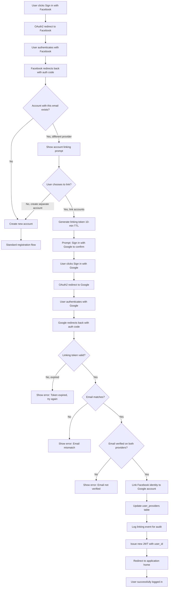
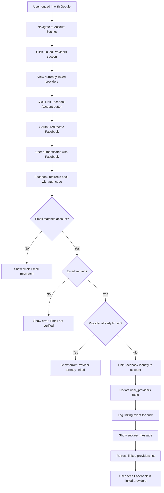
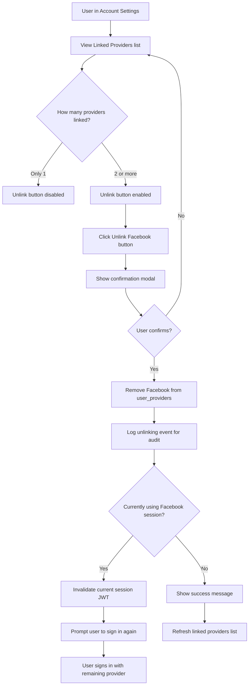

## Overview

This user journey describes how users can link multiple OAuth2/OIDC provider identities (Google, Facebook, Apple) to a single user account, allowing them to sign in with any of their linked providers. This addresses the common scenario where users forget which provider they used for registration or prefer to use different providers at different times.

**User Personas:**
- **Existing users** who registered with one provider (e.g., Google) and want to add alternative sign-in options (e.g., Facebook)
- **New users** who attempt to sign in with a different provider than they used for registration
- **Security-conscious users** who want to review and manage their linked authentication providers

**Business Value:**
- Reduces user frustration from forgetting which provider they used
- Decreases duplicate account creation
- Improves user retention and satisfaction
- Provides users with authentication flexibility

**User Goals:**
- Link a new OAuth provider to an existing account
- Sign in using any linked provider
- Review which providers are currently linked
- Remove (unlink) providers that are no longer needed

**Implementation Basis:**
This journey implements the decision from [ADR-0005: Account Linking Strategy](/r&d/adrs/0005-account-linking/), which selected **Option 2: Explicit User-Initiated Linking Only** for maximum security and user control.

## Journey Flow Diagram

### Flow 1: Login-Initiated Account Linking

**Narrative Description:**

1. **Initial Authentication Attempt**: User attempts to sign in with Facebook (the new provider they haven't used before)
2. **OAuth Flow**: Standard OAuth2/OIDC flow completes with Facebook
3. **Account Detection**: System detects an existing account with the same email address but registered with a different provider (Google)
4. **Linking Prompt**: User is shown a clear message: "An account with this email already exists. Would you like to link your Facebook account to it, or create a separate account?"
5. **User Decision**:
   - **Decline**: Creates a new separate account (standard registration flow)
   - **Accept**: Proceeds with linking flow
6. **Identity Verification**: User must authenticate with the original provider (Google) to prove they own both identities
7. **Linking Token**: A time-limited linking token (10-minute TTL) is generated and stored to maintain state across the second OAuth flow
8. **Second OAuth Flow**: User completes OAuth flow with Google to verify ownership
9. **Validation**: System validates:
   - Linking token is still valid (not expired)
   - Email addresses from both providers match
   - Both emails are verified by their respective providers
10. **Linking Execution**: Upon successful validation, Facebook identity is linked to the Google account
11. **Database Update**: `user_providers` table is updated with the new provider mapping
12. **Audit Logging**: Account linking event is logged for security audit trail
13. **Session Creation**: New JWT is issued with the consistent `user_id`
14. **Completion**: User is logged in and redirected to the application

### Flow 2: Settings-Initiated Account Linking

**Narrative Description:**

1. **Access Settings**: User navigates to Account Settings > Linked Providers while already authenticated
2. **Current State**: User sees list of currently linked providers (e.g., only Google)
3. **Initiate Linking**: User clicks "Link Facebook Account" button
4. **OAuth Flow**: Standard OAuth2/OIDC flow with Facebook
5. **Validation**: System validates:
   - Email from Facebook matches the account's email
   - Email is verified by Facebook
   - Facebook provider is not already linked to this account
6. **Linking Execution**: Facebook identity is added to the account
7. **Database Update**: `user_providers` table is updated
8. **Audit Logging**: Linking event is logged
9. **User Feedback**: Success message displayed
10. **UI Update**: Linked providers list refreshes to show Facebook

### Flow 3: Account Unlinking

**Narrative Description:**

1. **Access Linked Providers**: User views their linked providers in Account Settings
2. **Validation Check**: System ensures at least one provider will remain after unlinking
3. **Initiate Unlinking**: User clicks "Unlink" button next to a provider (e.g., Facebook)
4. **Confirmation**: Modal asks: "Are you sure you want to unlink Facebook? You will only be able to sign in with your remaining providers."
5. **User Confirms**: User confirms the unlinking action
6. **Database Update**: Facebook entry is removed from `user_providers` table
7. **Audit Logging**: Unlinking event is logged
8. **Session Handling**: If user's current session is via the provider being unlinked, session is invalidated and user must re-authenticate
9. **User Feedback**: Success message shown or re-authentication prompt displayed
10. **UI Update**: Linked providers list refreshes

## Technical Requirements

### Access Control

#### REQ-AC-001
- **Priority**: P0
- **Description**: Only authenticated users can initiate account linking or unlinking operations
- **Rationale**: Prevents unauthorized modification of user accounts. Users must prove they own the account before making changes to linked providers.

#### REQ-AC-002
- **Priority**: P0
- **Description**: User must authenticate with both providers to complete linking during login flow
- **Rationale**: Ensures user controls both identities before merging accounts, preventing account takeover via compromised email or social engineering.

#### REQ-AC-003
- **Priority**: P0
- **Description**: Email addresses from both providers must match to enable linking
- **Rationale**: Primary identity verification mechanism. Prevents linking unrelated accounts.

#### REQ-AC-004
- **Priority**: P0
- **Description**: Both providers must return `email_verified: true` before linking is allowed
- **Rationale**: Ensures email ownership is confirmed by the OAuth provider. Mitigates email spoofing and unverified email attacks.

#### REQ-AC-005
- **Priority**: P1
- **Description**: Prevent linking the same provider identity to multiple user accounts
- **Rationale**: Ensures uniqueness constraint. A given `provider:sub` combination should only map to one user account.

#### REQ-AC-006
- **Priority**: P0
- **Description**: System must prevent unlinking the last remaining provider on an account
- **Rationale**: Users must always have at least one authentication method to access their account. Unlinking all providers would lock the user out.

### Rate Limits

#### REQ-RL-001
- **Priority**: P1
- **Description**: Limit account linking attempts to 5 per hour per user account
- **Rationale**: Prevents abuse and brute-force attacks where an attacker attempts to link multiple providers rapidly.

#### REQ-RL-002
- **Priority**: P1
- **Description**: Limit account linking attempts to 10 per hour per IP address
- **Rationale**: Prevents distributed attacks where multiple accounts are targeted from the same source.

#### REQ-RL-003
- **Priority**: P2
- **Description**: Limit account unlinking operations to 3 per day per user account
- **Rationale**: Prevents suspicious behavior patterns. Legitimate users rarely unlink and re-link providers frequently.

### Analytics

#### REQ-AN-001
- **Priority**: P1
- **Description**: Track successful account linking events with provider details (Google, Facebook, Apple)
- **Rationale**: Understand which providers users prefer to link and measure feature adoption. Helps identify which OAuth flows are most successful.

#### REQ-AN-002
- **Priority**: P1
- **Description**: Track failed linking attempts with failure reasons (email mismatch, unverified email, token expired, etc.)
- **Rationale**: Identify common user errors and system issues. High failure rates indicate UX problems or provider integration issues.

#### REQ-AN-003
- **Priority**: P2
- **Description**: Track unlinking events and reasons (if user provides feedback)
- **Rationale**: Understand why users remove providers. May indicate provider-specific authentication issues or user preference changes.

#### REQ-AN-004
- **Priority**: P1
- **Description**: Measure time-to-completion for linking flows (login-initiated vs. settings-initiated)
- **Rationale**: Identify friction points in the linking process. Long completion times suggest UX improvements needed.

#### REQ-AN-005
- **Priority**: P2
- **Description**: Track linking token expiration rate (how many tokens expire before use)
- **Rationale**: High expiration rates suggest the 10-minute TTL may be too short or users are confused about the flow.

### Data Storage

#### REQ-DS-001
- **Priority**: P0
- **Description**: Store multiple provider identities per user in `user_providers` table with columns: `user_id`, `provider`, `provider_user_id` (sub claim), `email`, `email_verified`, `linked_at`
- **Rationale**: Core data model for supporting multiple providers per account. Enables querying by provider or by user.

#### REQ-DS-002
- **Priority**: P0
- **Description**: Store linking tokens with fields: `token_id`, `user_id`, `provider_to_link`, `email`, `created_at`, `expires_at` (10-minute TTL)
- **Rationale**: Maintains state during the two-step linking flow when initiated at login. Tokens must be stored server-side to prevent tampering.

#### REQ-DS-003
- **Priority**: P1
- **Description**: Store audit logs for account linking/unlinking events with fields: `event_id`, `user_id`, `event_type` (link/unlink), `provider`, `timestamp`, `ip_address`, `user_agent`
- **Rationale**: Security audit trail for investigating suspicious account activity or account takeover attempts. Critical for security incident response.

#### REQ-DS-004
- **Priority**: P0
- **Description**: Enforce unique constraint on `(provider, provider_user_id)` in `user_providers` table
- **Rationale**: Prevents the same provider identity from being linked to multiple accounts, which would create security vulnerabilities.

#### REQ-DS-005
- **Priority**: P1
- **Description**: Cascade delete linking tokens when user account is deleted
- **Rationale**: Data cleanup and privacy compliance. Expired or unused tokens should not persist indefinitely.

### Authorization (OpenFGA Integration)

#### REQ-AZ-001
- **Priority**: P0
- **Description**: When a new provider is linked, ensure all existing OpenFGA relationships are accessible via the new provider identity (`user:facebook:456` should have same permissions as `user:google:123`)
- **Rationale**: Users expect consistent access to their resources regardless of which linked provider they use to sign in. Prevents broken access after linking.

#### REQ-AZ-002
- **Priority**: P1
- **Description**: When a provider is unlinked, remove only that provider's identity from OpenFGA relationships if it was directly granted permissions (keep permissions granted to other identities)
- **Rationale**: Prevents accidental permission loss. If a user was granted access as `user:google:123`, unlinking Facebook should not affect those permissions.

#### REQ-AZ-003
- **Priority**: P2
- **Description**: Provide a canonical user identity (`user:{user_id}`) in OpenFGA that all linked provider identities map to
- **Rationale**: Simplifies permission management. Granting permissions to the canonical ID automatically applies to all current and future linked providers.

### Session Management

#### REQ-SM-001
- **Priority**: P0
- **Description**: After successful account linking, issue a new JWT containing the consistent `user_id` (not provider-specific identity)
- **Rationale**: Ensures the session represents the unified account. JWT should use a stable identifier across all linked providers.

#### REQ-SM-002
- **Priority**: P1
- **Description**: If a user unlinks the provider they are currently authenticated with, invalidate the current session and prompt re-authentication
- **Rationale**: Prevents the user from remaining logged in via a provider they just removed. Ensures session state is consistent with account state.

#### REQ-SM-003
- **Priority**: P1
- **Description**: Linking tokens must expire after 10 minutes
- **Rationale**: Limits the window for token theft or replay attacks. Forces users to complete the linking flow in a reasonable timeframe.

### User Experience

#### REQ-UX-001
- **Priority**: P0
- **Description**: Display clear messaging when account linking is offered during login: "An account with this email already exists. Link accounts or create a new one?"
- **Rationale**: Users must understand they have a choice. Unclear messaging leads to confusion and duplicate accounts.

#### REQ-UX-002
- **Priority**: P1
- **Description**: Show which providers are currently linked in Account Settings with ability to add or remove providers
- **Rationale**: Users need visibility and control over their authentication methods. Transparency builds trust.

#### REQ-UX-003
- **Priority**: P1
- **Description**: Disable "Unlink" button when only one provider remains, with tooltip explaining why
- **Rationale**: Prevents users from accidentally locking themselves out. Clear explanation reduces support requests.

#### REQ-UX-004
- **Priority**: P1
- **Description**: Show confirmation modal before unlinking with warning: "You will only be able to sign in with your remaining providers"
- **Rationale**: Ensures users understand the consequences of unlinking. Reduces accidental unlink operations.

#### REQ-UX-005
- **Priority**: P2
- **Description**: Send email notification when a provider is linked or unlinked
- **Rationale**: Security notification. If an attacker links a provider, the account owner is alerted and can take action.

### Error Handling

#### REQ-EH-001
- **Priority**: P0
- **Description**: Display user-friendly error when email addresses don't match between providers: "The email from [Provider] doesn't match your account email"
- **Rationale**: Clear error messaging helps users understand what went wrong and how to fix it.

#### REQ-EH-002
- **Priority**: P0
- **Description**: Display error when email is not verified by provider: "[Provider] did not verify your email address. Please verify your email with [Provider] first."
- **Rationale**: Guides users to the correct resolution. Email verification is a security requirement.

#### REQ-EH-003
- **Priority**: P0
- **Description**: Display error when linking token has expired: "Your linking request expired. Please try again."
- **Rationale**: Explains the timeout clearly and provides path forward (retry).

#### REQ-EH-004
- **Priority**: P1
- **Description**: Display error when attempting to link a provider that's already linked: "This [Provider] account is already linked to your account."
- **Rationale**: Prevents confusion when users forget they already linked a provider.

#### REQ-EH-005
- **Priority**: P1
- **Description**: Display error when attempting to link a provider already associated with a different account: "This [Provider] account is already linked to another user account."
- **Rationale**: Prevents account conflicts. Users may need to contact support to resolve.

### Other Requirements

#### REQ-OT-001
- **Priority**: P1
- **Description**: Support email verification status checks for each provider (Google: highly reliable, Apple: always verified, Facebook: may require Graph API check)
- **Rationale**: Different OAuth providers have varying levels of email verification guarantees. System must handle provider-specific quirks.

#### REQ-OT-002
- **Priority**: P2
- **Description**: Provide API endpoint `GET /v1/account/providers` to retrieve list of linked providers for the authenticated user
- **Rationale**: Enables UI to display current provider links. Also useful for third-party integrations or mobile apps.

#### REQ-OT-003
- **Priority**: P1
- **Description**: Provide API endpoint `POST /v1/account/link/{provider}` to initiate linking flow for the specified provider
- **Rationale**: Core API for settings-initiated linking. Starts OAuth flow and returns redirect URL.

#### REQ-OT-004
- **Priority**: P1
- **Description**: Provide API endpoint `DELETE /v1/account/unlink/{provider}` to unlink the specified provider from the account
- **Rationale**: Core API for unlinking. Must validate at least one provider remains before executing.

#### REQ-OT-005
- **Priority**: P2
- **Description**: Provide callback endpoint `GET /v1/auth/{provider}/callback/link` to handle OAuth redirects specifically for linking flows
- **Rationale**: Separates linking callback from standard login callback. Allows different logic and validation for linking vs. initial authentication.

#### REQ-OT-006
- **Priority**: P2
- **Description**: Support "Remember this device" functionality to reduce re-authentication friction for linking initiated from settings
- **Rationale**: Users on trusted devices shouldn't need to re-enter credentials frequently. Improves UX while maintaining security.

## Success Metrics

**Quantitative Metrics:**

- **Linking Completion Rate**: Percentage of users who complete linking flow after being prompted (target: >70%)
  - Measures UX clarity and flow simplicity
  - Low rate suggests confusing prompts or excessive friction

- **Time to Complete Linking**: Average time from initiation to successful linking (target: <2 minutes)
  - Identifies bottlenecks in the flow
  - Long times suggest UX improvements needed

- **Duplicate Account Reduction**: Decrease in duplicate accounts with same email address (target: 50% reduction within 6 months)
  - Primary business value metric
  - Indicates feature is solving the "forgot which provider" problem

- **Provider Link Adoption**: Percentage of users with 2+ providers linked (target: 30% of active users within 1 year)
  - Shows feature value and user engagement
  - Higher adoption suggests users find linking useful

- **Unlinking Rate**: Percentage of linked providers that are later unlinked (target: <5%)
  - High rate may indicate linking errors or provider issues
  - Should be monitored for anomalies

**Qualitative Metrics:**

- **User Satisfaction**: Survey users who linked accounts about ease of use (target: 4/5 stars)
  - Gathered via post-linking survey or in-app feedback
  - Identifies pain points in the flow

- **Support Ticket Reduction**: Decrease in support tickets about "can't find my account" or "wrong provider" (target: 40% reduction)
  - Demonstrates reduced user confusion
  - Cost savings from lower support burden

- **Security Incident Rate**: Number of account takeover attempts via account linking (target: 0)
  - Critical security metric
  - Any incidents require immediate investigation

## Related Documentation

- [ADR-0005: Account Linking Strategy](/r&d/adrs/0005-account-linking/) - Decision to use explicit user-initiated linking
- [ADR-0002: SSO Authentication Strategy](/r&d/adrs/0002-sso-authentication-strategy/) - OAuth2/OIDC authentication foundation
- [ADR-0003: OAuth2/OIDC Provider Selection](/r&d/adrs/0003-oauth2-oidc-provider-selection/) - Selected providers (Google, Facebook, Apple)
- [ADR-0004: Session Management](/r&d/adrs/0004-session-management/) - JWT token handling during linking
- [User Journey 0001: User Registration](/r&d/user-journeys/0001-user-registration/) - References REQ-AC-004 for account linking support
- [User Journey 0002: User Login via SSO](/r&d/user-journeys/0002-user-login-via-sso/) - References REQ-OT-010 for linking workflow
- API Documentation: POST /v1/account/link/{provider} (to be created)
- API Documentation: DELETE /v1/account/unlink/{provider} (to be created)
- API Documentation: GET /v1/account/providers (to be created)
- API Documentation: GET /v1/auth/{provider}/callback/link (to be created)

## Notes

### Implementation Phases

**Phase 1 (MVP - P0 Requirements):**
- Basic linking flow during login (Flow 1)
- Settings-initiated linking (Flow 2)
- Core API endpoints: POST /v1/account/link/{provider}, DELETE /v1/account/unlink/{provider}
- Basic unlinking with validation (Flow 3)
- Email verification and matching validation
- Database schema: `user_providers` and `linking_tokens` tables

**Phase 2 (Enhanced - P1 Requirements):**
- Rate limiting on linking operations
- Audit logging for security events
- Analytics tracking for linking events
- Email notifications on link/unlink
- Improved error messaging
- OpenFGA relationship updates during linking

**Phase 3 (Polish - P2 Requirements):**
- Advanced analytics (time-to-completion, token expiration rates)
- "Remember this device" functionality
- Enhanced unlinking reasons tracking
- Canonical user identity in OpenFGA

### Security Considerations

1. **Email Verification Trust Levels**: Different providers have varying email verification reliability. System should handle:
   - Google: Highly reliable `email_verified` claim
   - Apple: Always verified (Apple's policy)
   - Facebook: May require Graph API verification as fallback

2. **Linking Token Security**:
   - Tokens must be cryptographically secure (use UUID v4 or better)
   - Store server-side (not in URL parameters or client-side)
   - Single-use (invalidate after successful linking or expiration)
   - Short TTL (10 minutes balances security and UX)

3. **Session Invalidation**: When unlinking the current provider, invalidate the JWT immediately to prevent continued access via removed authentication method

4. **Audit Trail**: Comprehensive logging is critical for:
   - Security incident investigation
   - Detecting account takeover patterns
   - Compliance requirements (GDPR, SOC 2)

### Future Enhancements

- **Account Merging**: Allow users to merge two completely separate accounts (more complex than linking)
- **Primary Provider**: Let users designate a "primary" provider that's shown first in login UI
- **Provider Priority**: Remember which provider the user last used and suggest it first
- **Backup Codes**: Provide one-time backup codes in case all OAuth providers become unavailable
- **Federated Logout**: When user unlinks a provider, optionally log them out of that provider too
- **Link via Email Confirmation**: Alternative linking flow where user confirms via email instead of re-authenticating

### Testing Considerations

- **Cross-provider Testing**: Test all combinations (Google→Facebook, Facebook→Apple, etc.)
- **Email Edge Cases**: Test with:
  - Uppercase/lowercase email variations
  - Plus addressing (email+tag@gmail.com)
  - Email changes at provider level
- **Token Expiration**: Verify 10-minute TTL enforcement and proper error handling
- **Concurrent Linking**: Test behavior when user attempts multiple linking operations simultaneously
- **Provider Failures**: Handle OAuth errors gracefully (user cancels, provider timeout, network issues)
