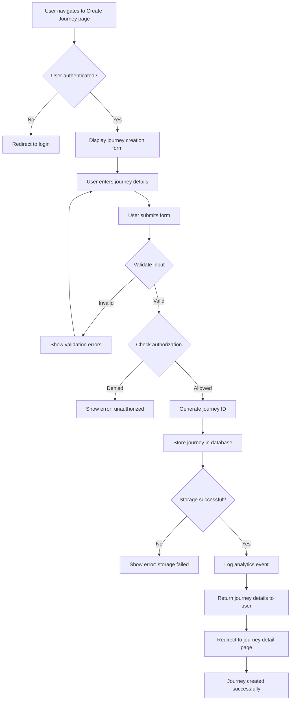

## Overview

This journey describes the process by which an authenticated user creates a new journey to document a real-life adventure. A journey represents a collection of photos, videos, locations, and transportation routes associated with a specific trip or adventure (e.g., a weekend hiking trip, a European vacation, a road trip across the country). The journey creation flow ensures proper validation, authorization, and data persistence while providing a smooth user experience.

**User Persona**: Authenticated user who is about to embark on (or has recently completed) an adventure and wants to capture and organize media, locations, and routes associated with that experience.

**Business Value**: Enabling users to create journeys is the core value proposition of the application, allowing them to organize adventure content in a private, user-controlled way rather than on public social media platforms.

**User Goals**:
- Create a new journey with a meaningful name and description for their adventure
- Receive immediate confirmation that the journey was created
- Be able to start adding photos, videos, locations, and routes immediately after creation
- Keep the journey fully private by default (shared only out-of-band with friends/family if desired)

## Journey Flow Diagram

**Flow Narrative**:

1. **Entry**: User navigates to the journey creation page (e.g., clicks "Create Journey" button)
2. **Authentication Check**: System verifies user is authenticated via JWT token
3. **Form Display**: If authenticated, display the journey creation form with fields for name, description, and other metadata
4. **Input Collection**: User fills in journey details and submits the form
5. **Validation**: System validates input (e.g., name length, required fields, content safety)
6. **Authorization Check**: System verifies user has permission to create journeys (via authorization service)
7. **ID Generation**: System generates a unique UUID for the new journey
8. **Data Persistence**: Journey data is stored in the database
9. **Analytics**: System logs a "journey_created" event for tracking purposes
10. **Confirmation**: User is redirected to the newly created journey's detail page with success confirmation

## Technical Requirements

### Access Control

#### REQ-AC-001
- **Priority**: P0
- **Description**: Only authenticated users can create journeys. The API must validate the JWT token and extract the user identity before processing the request.
- **Rationale**: Journeys must be owned by authenticated users to enable proper access control, data ownership, and future authorization checks.

#### REQ-AC-002
- **Priority**: P0
- **Description**: The authorization system must verify the user has the "create_journey" permission before allowing journey creation.
- **Rationale**: Enables future business rules like subscription tiers (e.g., free users limited to 5 journeys, premium users unlimited) or administrative controls.

#### REQ-AC-003
- **Priority**: P1
- **Description**: Users should only be able to create journeys under their own account, not on behalf of other users.
- **Rationale**: Prevents privilege escalation and ensures data integrity. Admin/delegation features can be added later if needed.

### Rate Limits

#### REQ-RL-001
- **Priority**: P1
- **Description**: Implement rate limiting on the journey creation endpoint: 10 journeys per minute per user, 100 journeys per day per user.
- **Rationale**: Prevents abuse, spam, and database bloat. Protects system resources and ensures fair usage.

#### REQ-RL-002
- **Priority**: P2
- **Description**: Implement global rate limiting: 1000 journey creations per minute across all users.
- **Rationale**: Protects system resources during traffic spikes or potential DDoS attacks.

### Analytics

#### REQ-AN-001
- **Priority**: P0
- **Description**: Log a "journey_created" event with metadata including user_id, journey_id, timestamp, and success/failure status.
- **Rationale**: Essential for understanding user behavior, measuring feature adoption, and debugging issues.

#### REQ-AN-002
- **Priority**: P1
- **Description**: Track journey creation funnel metrics: page views, form starts, form submissions, validation failures, and successful creations.
- **Rationale**: Helps identify friction points in the creation flow and optimize conversion rates.

#### REQ-AN-003
- **Priority**: P2
- **Description**: Capture metadata about journey content (e.g., name length, description length, use of optional fields) for product insights.
- **Rationale**: Informs future feature development and UX improvements based on actual usage patterns.

### Data Storage

#### REQ-DS-001
- **Priority**: P0
- **Description**: Store journey records with the following schema:
  - `id` (UUID, primary key)
  - `owner_id` (string, maps to OAuth provider user ID, indexed)
  - `name` (string, max 200 characters, required) - e.g., "Summer 2025 Europe Trip"
  - `description` (string, max 5000 characters, optional) - e.g., "Two week adventure through France and Italy"
  - `start_date` (timestamp, optional) - When the adventure began or is planned to begin
  - `end_date` (timestamp, optional) - When the adventure ended or is planned to end
  - `created_at` (timestamp, required)
  - `updated_at` (timestamp, required)
  - `status` (enum: active, archived, deleted, required, default: active)
- **Rationale**: Core data model for journeys. Includes necessary fields for ownership, display, lifecycle management, and temporal context of the adventure.

#### REQ-DS-002
- **Priority**: P0
- **Description**: Ensure journey IDs are globally unique UUIDs (v4 or v7).
- **Rationale**: UUIDs prevent ID collisions, enable distributed ID generation, and avoid exposing sequential numbering that reveals business metrics.

#### REQ-DS-003
- **Priority**: P1
- **Description**: Index the `owner_id` field for efficient querying of user's journeys.
- **Rationale**: Users will frequently list their own journeys; indexing ensures fast queries as data grows.

#### REQ-DS-004
- **Priority**: P2
- **Description**: Implement soft deletion (set status to "deleted" rather than hard delete) with a cleanup process for old deleted records.
- **Rationale**: Enables data recovery, audit trails, and analytics on deleted content. Reduces risk of accidental data loss.

### Validation

#### REQ-VL-001
- **Priority**: P0
- **Description**: Validate journey name is non-empty, between 1-200 characters, and contains valid UTF-8.
- **Rationale**: Ensures data quality and prevents UI rendering issues with excessively long names.

#### REQ-VL-002
- **Priority**: P0
- **Description**: Validate journey description is optional but if provided, must be between 0-5000 characters with valid UTF-8.
- **Rationale**: Balances user flexibility with database constraints and UI rendering concerns.

#### REQ-VL-003
- **Priority**: P1
- **Description**: Sanitize user input to prevent XSS attacks (strip HTML tags, encode special characters).
- **Rationale**: Security best practice to prevent stored XSS vulnerabilities.

#### REQ-VL-004
- **Priority**: P2
- **Description**: Implement content moderation to flag or reject journeys with inappropriate names/descriptions.
- **Rationale**: Maintains platform quality and prevents abuse, especially important if journeys become shareable.

### API Design

#### REQ-API-001
- **Priority**: P0
- **Description**: Implement POST `/v1/journeys` endpoint that accepts JSON request body with `name` and optional `description` fields. Returns 201 Created with journey details including generated ID.
- **Rationale**: RESTful design pattern for resource creation. 201 status code clearly indicates successful creation.

#### REQ-API-002
- **Priority**: P0
- **Description**: Return detailed error responses with appropriate HTTP status codes:
  - 400 Bad Request for validation errors
  - 401 Unauthorized for missing/invalid JWT
  - 403 Forbidden for authorization failures
  - 429 Too Many Requests for rate limit violations
  - 500 Internal Server Error for storage/system failures
- **Rationale**: Clear error responses enable better client error handling and debugging.

#### REQ-API-003
- **Priority**: P1
- **Description**: Include `Location` header in 201 response pointing to the new journey resource (e.g., `/v1/journeys/{id}`).
- **Rationale**: REST best practice that enables clients to immediately navigate to the created resource.

### Performance

#### REQ-PF-001
- **Priority**: P1
- **Description**: Journey creation should complete in under 500ms at p95 under normal load.
- **Rationale**: Ensures responsive user experience and prevents timeout issues.

#### REQ-PF-002
- **Priority**: P2
- **Description**: System should handle 100 concurrent journey creations without degradation.
- **Rationale**: Ensures system can handle reasonable traffic spikes during peak usage.

## Success Metrics

**Quantitative Metrics:**

- **Creation Success Rate**: Target 95%+ of journey creation attempts succeed (excluding user-caused validation errors)
  - Measures system reliability and error handling effectiveness

- **Time to Create**: Target p95 response time < 500ms
  - Measures user experience quality and system performance

- **Adoption Rate**: Target 80%+ of new users create at least one journey within first session
  - Measures feature discoverability and value proposition clarity

- **Creation Volume**: Track daily/weekly journey creation trends
  - Measures feature usage and platform growth

**Qualitative Metrics:**

- **User Satisfaction**: Target 4+ out of 5 stars on journey creation experience
  - Gather through in-app surveys or user feedback

- **Error Clarity**: Target <10% of users contacting support about creation errors
  - Measures quality of error messages and self-service capability

## Related Documentation

**Existing ADRs:**
- [ADR-0002: SSO Authentication Strategy](../adrs/0002-sso-authentication-strategy.md) - Authentication approach using OAuth2/OIDC
- [ADR-0004: Session Management Strategy](../adrs/0004-session-management-strategy.md) - JWT token validation
- [ADR-0006: API Development Tech Stack Selection](../adrs/0006-api-dev-tech-stack-selection.md) - Humus framework usage

**Required ADRs (Not Yet Created):**
- **Database Technology Selection** - Need to decide on database for storing journeys (PostgreSQL, MySQL, etc.) to support REQ-DS-001 through REQ-DS-004
- **Analytics/Observability Strategy** - Need to decide how analytics events will be recorded and stored to support REQ-AN-001 through REQ-AN-003 (OpenTelemetry metrics? Custom event logging? Third-party service?)

**Related User Journeys:**
- [User Journey 0001: User Registration](0001-user-registration.md) - How users initially authenticate
- [User Journey 0002: User Login via SSO](0002-user-login-via-sso.md) - How users authenticate before creating journeys

## Notes

**Future Enhancements:**
- Journey templates (e.g., "Road Trip", "Hiking Adventure", "City Exploration") to accelerate creation
- Rich text editor for journey descriptions with markdown support
- Cover photo selection during journey creation
- Journey visibility settings (private by default, with out-of-band sharing options)
- Journey categories/tags for organization (e.g., #hiking, #europe, #family)
- Duplicate journey feature to create similar trips (e.g., annual camping trips)
- Import journey from GPX/KML files (for pre-planned routes)
- Geo-fence triggers to automatically suggest journey creation when entering new locations

**Technical Considerations:**
- Consider implementing optimistic UI updates on the client side for perceived performance
- Mobile-first design is critical since users will likely create journeys on their phones while traveling
- Consider offline-first capabilities to allow journey creation without internet connectivity
- Future migrations may require schema changes; ensure database supports migrations (e.g., Flyway, Liquibase, or custom Go migration tool)
- Journey creation may need to support batch/bulk operations if users import from existing photo collections

**Business Considerations:**
- Journey limits may be used to differentiate pricing tiers (free vs. premium)
- Creation patterns (time of day, frequency) could inform notification/engagement strategies
- High creation rates with low content addition may indicate users aren't finding value in the media/location features
- Privacy-first approach is a key differentiator from social media platforms - ensure this is clear in UX
