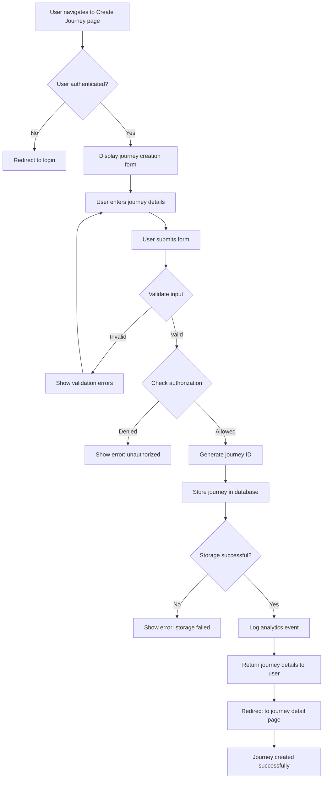

## Overview

This journey describes the process by which an authenticated user creates a new journey to document a real-life adventure. A journey represents a collection of photos, videos, locations, and transportation routes associated with a specific trip or adventure (e.g., a weekend hiking trip, a European vacation, a road trip across the country).

**Business Value**: Enabling users to create journeys is the core value proposition of the application, allowing them to organize adventure content in a private, user-controlled way rather than on public social media platforms.

## User Personas

**Primary Persona**: Adventure Documenter
- **Description**: Authenticated user who is about to embark on (or has recently completed) an adventure and wants to capture and organize media, locations, and routes associated with that experience. This could be a casual weekend traveler or a frequent globetrotter.
- **Goals**:
  - Create a new journey with a meaningful name and description for their adventure
  - Receive immediate confirmation that the journey was created
  - Be able to start adding photos, videos, locations, and routes immediately after creation
  - Keep the journey fully private by default (shared only out-of-band with friends/family if desired)
- **Pain Points**:
  - Social media platforms lack privacy and force public sharing
  - Existing photo apps don't organize content by trip/journey
  - Difficult to associate routes and locations with specific adventures
  - Tedious to manually organize hundreds of photos from a trip

## Journey Flow Diagram

**Flow Narrative**:

1. **Entry**: User navigates to the journey creation page (e.g., clicks "Create Journey" button)
2. **Authentication Check**: System verifies user is authenticated via JWT token
3. **Form Display**: If authenticated, display the journey creation form with fields for name, description, and other metadata
4. **Input Collection**: User fills in journey details and submits the form
5. **Validation**: System validates input (e.g., name length, required fields, content safety)
6. **Authorization Check**: System verifies user has permission to create journeys
7. **ID Generation**: System generates a unique identifier for the new journey
8. **Data Persistence**: Journey data is stored in the database
9. **Analytics**: System logs a "journey_created" event for tracking purposes
10. **Confirmation**: User is redirected to the newly created journey's detail page with success confirmation

## Requirements

### Access Control

#### REQ-AC-001
- **Priority**: P0
- **Description**: Only authenticated users can create journeys. The system must validate user authentication before allowing journey creation.
- **Rationale**: Journeys must be owned by authenticated users to ensure privacy, enable data ownership, and prevent unauthorized access. This aligns with the core value proposition of user-controlled, private content management.

#### REQ-AC-002
- **Priority**: P0
- **Description**: Users can only create journeys under their own account, not on behalf of other users.
- **Rationale**: Ensures data integrity and prevents unauthorized journey creation. Supports the privacy-first approach where users have full control over their own content.

#### REQ-AC-003
- **Priority**: P1
- **Description**: The system should support permission verification to enable future business rules (e.g., subscription tiers with journey limits).
- **Rationale**: Enables future monetization strategies where free users may have journey limits while premium users have unlimited journeys.

### Analytics

#### REQ-AN-001
- **Priority**: P0
- **Description**: Track journey creation events including user identity, journey identity, timestamp, and success/failure status.
- **Rationale**: Essential for measuring feature adoption, understanding user behavior patterns, and identifying issues that impact the user experience. Supports data-driven decisions for improving the journey creation flow.

#### REQ-AN-002
- **Priority**: P1
- **Description**: Track journey creation funnel metrics including page views, form starts, form submissions, validation failures, and successful creations.
- **Rationale**: Identifies friction points in the user experience where users abandon the creation process, enabling optimization of conversion rates and user satisfaction.

#### REQ-AN-003
- **Priority**: P2
- **Description**: Capture metadata about journey attributes (e.g., name length, description usage, date field usage) for product insights.
- **Rationale**: Informs future UX improvements and feature development based on how users actually interact with the journey creation form.

## Success Metrics

**Quantitative Metrics:**

- **Creation Success Rate**: Target 95%+ of journey creation attempts succeed (excluding user-caused validation errors)
  - Measures system reliability and error handling effectiveness

- **Time to Create**: Target p95 response time < 500ms
  - Measures user experience quality and system performance

- **Adoption Rate**: Target 80%+ of new users create at least one journey within first session
  - Measures feature discoverability and value proposition clarity

- **Creation Volume**: Track daily/weekly journey creation trends
  - Measures feature usage and platform growth

**Qualitative Metrics:**

- **User Satisfaction**: Target 4+ out of 5 stars on journey creation experience
  - Gather through in-app surveys or user feedback

- **Error Clarity**: Target <10% of users contacting support about creation errors
  - Measures quality of error messages and self-service capability

## Related Documentation

**Existing ADRs:**
- [ADR-0002: SSO Authentication Strategy](../adrs/0002-sso-authentication-strategy.md) - Authentication approach using OAuth2/OIDC
- [ADR-0004: Session Management Strategy](../adrs/0004-session-management-strategy.md) - JWT token validation
- [ADR-0006: API Development Tech Stack Selection](../adrs/0006-api-dev-tech-stack-selection.md) - Humus framework usage

**Required ADRs (Not Yet Created):**
- **Database Technology Selection** - Need to decide on database technology and data modeling approach for storing journey records, including schema design, identifier strategy, indexing, and lifecycle management
- **Analytics/Observability Strategy** - Need to decide how analytics events will be recorded, stored, and analyzed to support tracking journey creation metrics and user behavior (OpenTelemetry metrics? Custom event logging? Third-party analytics service?)

**Related User Journeys:**
- [User Journey 0001: User Registration](0001-user-registration.md) - How users initially authenticate
- [User Journey 0002: User Login via SSO](0002-user-login-via-sso.md) - How users authenticate before creating journeys

**API Documentation:**
- API documentation for journey creation endpoints needs to be created, including request/response schemas, validation rules, error handling, and HTTP conventions

## Notes

**Future Enhancements:**
- Journey templates (e.g., "Road Trip", "Hiking Adventure", "City Exploration") to accelerate creation
- Rich text editor for journey descriptions with markdown support
- Cover photo selection during journey creation
- Journey visibility settings (private by default, with out-of-band sharing options)
- Journey categories/tags for organization (e.g., #hiking, #europe, #family)
- Duplicate journey feature to create similar trips (e.g., annual camping trips)
- Import journey from GPX/KML files (for pre-planned routes)
- Geo-fence triggers to automatically suggest journey creation when entering new locations

**Technical Considerations:**
- Consider implementing optimistic UI updates on the client side for perceived performance
- Mobile-first design is critical since users will likely create journeys on their phones while traveling
- Consider offline-first capabilities to allow journey creation without internet connectivity
- Future migrations may require schema changes; ensure database supports migrations (e.g., Flyway, Liquibase, or custom Go migration tool)
- Journey creation may need to support batch/bulk operations if users import from existing photo collections

**Business Considerations:**
- Journey limits may be used to differentiate pricing tiers (free vs. premium)
- Creation patterns (time of day, frequency) could inform notification/engagement strategies
- High creation rates with low content addition may indicate users aren't finding value in the media/location features
- Privacy-first approach is a key differentiator from social media platforms - ensure this is clear in UX
