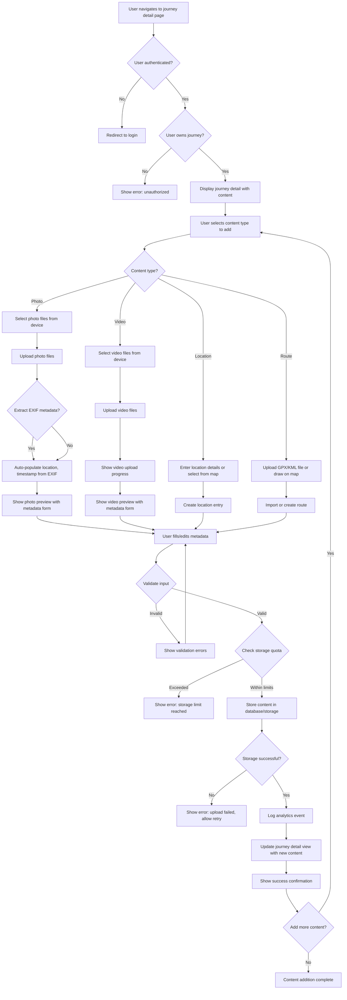

## Overview

This journey describes the process by which an authenticated user adds content to an existing journey. Content includes photos, videos, geographic locations (points of interest), and transportation routes (GPS tracks). This is the primary interaction users will have with the application after creating a journey, as they document their adventures in real-time or retroactively.

**Business Value**: Content addition is the core engagement mechanism of the application. The easier and more seamless this process, the more likely users are to actively use the platform to document their adventures. Rich content (photos, videos, locations, routes) makes journeys more meaningful and shareable.

## User Personas

**Primary Persona**: Active Adventure Documenter
- **Description**: Authenticated user with an existing journey who is actively experiencing an adventure (or recently completed one) and wants to add content to document it. This could be someone hiking a trail, exploring a city, on a road trip, or reviewing photos after returning home.
- **Goals**:
  - Quickly add photos and videos from their device (mobile or desktop)
  - Tag locations for photos/videos or add standalone points of interest
  - Upload GPS routes from fitness trackers or navigation apps
  - Associate content with specific dates/times during the journey
  - Preview and organize content within the journey
  - Maintain full privacy of all added content
- **Pain Points**:
  - Uploading large photo/video files can be slow or fail
  - Manually tagging every photo with location is tedious
  - Importing GPS tracks from various formats is complicated
  - Organizing hundreds of photos from a multi-day trip is overwhelming
  - Mobile data usage for uploads can be expensive while traveling
  - Need to work offline and sync later when internet is available

**Secondary Persona**: Retrospective Documenter
- **Description**: User who has returned from an adventure and is organizing photos, videos, and location data from their device or camera after the fact.
- **Goals**:
  - Batch upload multiple photos/videos efficiently
  - Automatically extract location data from photo EXIF metadata
  - Import routes from GPX files exported from GPS devices
  - Organize content chronologically or by location
  - Edit/remove content that didn't turn out well
- **Pain Points**:
  - Photos from multiple devices (phone, camera, GoPro) need to be consolidated
  - Not all devices tag photos with GPS coordinates
  - Large video files take forever to upload
  - Hard to remember which location corresponds to which photo

## Journey Flow Diagram

**Flow Narrative**:

1. **Entry**: User navigates to an existing journey's detail page
2. **Authentication & Authorization**: System verifies user is authenticated and owns the journey
3. **Content Selection**: User chooses which type of content to add (photo, video, location, or route)
4. **File/Data Input**:
   - Photos/Videos: User selects files from their device
   - Locations: User enters details or selects a point on a map
   - Routes: User uploads a GPX/KML file or draws a route on a map
5. **Upload & Processing**:
   - Photos: Uploaded to storage, EXIF metadata extracted for auto-population
   - Videos: Uploaded with progress indicator due to large file sizes
   - Locations/Routes: Geographic data validated and stored
6. **Metadata Collection**: User fills in or edits metadata (title, description, date/time, location)
7. **Validation**: System validates required fields, file formats, and content
8. **Quota Check**: System verifies user hasn't exceeded storage limits
9. **Persistence**: Content is stored in database and file storage
10. **Analytics**: System logs content addition event
11. **Confirmation**: Journey detail page updates to show new content with success message
12. **Continuation**: User can add more content or finish

## Requirements

### Access Control

#### REQ-AC-001
- **Priority**: P0
- **Description**: Only authenticated users can add content to journeys. The system must validate user authentication before allowing content uploads.
- **Rationale**: Ensures all content is associated with a valid user account, preventing anonymous uploads and maintaining data ownership.

#### REQ-AC-002
- **Priority**: P0
- **Description**: Users can only add content to journeys they own. The system must verify journey ownership before accepting content.
- **Rationale**: Critical security requirement to prevent unauthorized users from modifying other users' journeys. Ensures data integrity and user trust.

#### REQ-AC-003
- **Priority**: P1
- **Description**: The system should support delegated access in the future, allowing journey owners to grant content upload permissions to other users (e.g., travel companions).
- **Rationale**: Enables collaborative journey documentation where multiple travelers can contribute photos/content to a shared journey. However, this is a future enhancement beyond initial MVP.

### Data Storage

#### REQ-DS-001
- **Priority**: P0
- **Description**: Photos must be stored with preservation of original quality and metadata. Support common image formats (JPEG, PNG, HEIC).
- **Rationale**: Users expect their photos to be stored without quality loss. Original metadata (EXIF) contains valuable information like GPS coordinates and timestamps.

#### REQ-DS-002
- **Priority**: P0
- **Description**: Videos must be stored with support for common formats (MP4, MOV, AVI). Consider compression/transcoding for efficient storage and streaming.
- **Rationale**: Video files are large and expensive to store/transfer. Compression reduces costs while maintaining acceptable quality for web viewing.

#### REQ-DS-003
- **Priority**: P0
- **Description**: Location data must be stored with geographic coordinates (latitude/longitude), name, optional description, and timestamp.
- **Rationale**: Core data model for representing points of interest along the journey. Enables map visualization and chronological ordering.

#### REQ-DS-004
- **Priority**: P0
- **Description**: Route data must support GPX and KML file formats for import. Store routes as sequences of geographic coordinates with timestamps.
- **Rationale**: GPX and KML are standard formats used by GPS devices, fitness trackers, and mapping applications. Users need to import existing routes easily.

#### REQ-DS-005
- **Priority**: P1
- **Description**: The system should extract and preserve EXIF metadata from photos, including GPS coordinates, capture timestamp, camera make/model, and image dimensions.
- **Rationale**: Automates metadata population, reducing manual data entry. GPS coordinates enable automatic location tagging.

#### REQ-DS-006
- **Priority**: P1
- **Description**: Implement storage quotas per user (e.g., free tier: 5GB, premium tier: unlimited) to manage infrastructure costs.
- **Rationale**: Prevents abuse and manages storage costs. Enables freemium business model differentiation.

### File Upload

#### REQ-FU-001
- **Priority**: P0
- **Description**: Support chunked/resumable file uploads for photos and videos to handle network interruptions and large files.
- **Rationale**: Users may be uploading from locations with poor internet connectivity. Resumable uploads prevent frustration from failed uploads of large video files.

#### REQ-FU-002
- **Priority**: P0
- **Description**: Display upload progress indicators for photos and videos, including percentage complete and estimated time remaining.
- **Rationale**: Provides user feedback during potentially long upload operations. Reduces perceived wait time and user anxiety.

#### REQ-FU-003
- **Priority**: P0
- **Description**: Validate file types and sizes before upload. Reject unsupported formats or files exceeding maximum size limits (e.g., 100MB per photo, 2GB per video).
- **Rationale**: Prevents server-side processing of invalid files. Provides immediate user feedback on unsupported content.

#### REQ-FU-004
- **Priority**: P1
- **Description**: Support batch upload of multiple photos simultaneously with a single operation.
- **Rationale**: Users returning from a trip may have dozens or hundreds of photos to upload. Batch uploads significantly improve user experience.

#### REQ-FU-005
- **Priority**: P2
- **Description**: Generate thumbnail previews of photos and video frames for efficient gallery display without loading full-resolution files.
- **Rationale**: Improves page load performance and reduces bandwidth usage when viewing journey galleries.

### Analytics

#### REQ-AN-001
- **Priority**: P0
- **Description**: Track content addition events including user identity, journey identity, content type (photo/video/location/route), timestamp, file size, and success/failure status.
- **Rationale**: Essential for understanding feature usage patterns, identifying technical issues (e.g., high failure rates), and measuring platform engagement.

#### REQ-AN-002
- **Priority**: P1
- **Description**: Track upload performance metrics including upload duration, file size, network speed, and retry attempts.
- **Rationale**: Helps identify performance bottlenecks and infrastructure issues. Informs optimization priorities.

#### REQ-AN-003
- **Priority**: P1
- **Description**: Track content organization metrics including EXIF metadata usage, manual vs. auto-populated fields, and content editing frequency.
- **Rationale**: Informs UX improvements around metadata collection and content organization features.

#### REQ-AN-004
- **Priority**: P2
- **Description**: Track storage usage per user and aggregate storage metrics to inform infrastructure capacity planning.
- **Rationale**: Critical for cost management and capacity planning as user base grows.

### Data Validation

#### REQ-DV-001
- **Priority**: P0
- **Description**: Validate image and video file formats to prevent malicious file uploads. Reject executable files disguised as media.
- **Rationale**: Security requirement to prevent server compromise through malicious file uploads.

#### REQ-DV-002
- **Priority**: P0
- **Description**: Validate geographic coordinates for locations and routes to ensure they fall within valid latitude/longitude ranges.
- **Rationale**: Prevents data corruption from invalid coordinates that could break map visualizations.

#### REQ-DV-003
- **Priority**: P1
- **Description**: Validate GPX/KML file schema before import to ensure well-formed geographic data.
- **Rationale**: Prevents import failures and data corruption from malformed route files.

#### REQ-DV-004
- **Priority**: P1
- **Description**: Scan uploaded images and videos for inappropriate/harmful content using automated moderation tools.
- **Rationale**: While journeys are private by default, content moderation helps prevent platform abuse and protects against legal liability.

### Performance

#### REQ-PF-001
- **Priority**: P0
- **Description**: Photo uploads (up to 10MB) should complete in under 30 seconds on average mobile network speeds (4G).
- **Rationale**: Users expect quick uploads for typical smartphone photos. Longer waits lead to abandonment.

#### REQ-PF-002
- **Priority**: P1
- **Description**: The journey detail page should load and display existing content within 2 seconds, even for journeys with 100+ photos.
- **Rationale**: Fast page loads are critical for user satisfaction. Pagination or lazy loading may be required for large galleries.

#### REQ-PF-003
- **Priority**: P1
- **Description**: Support offline content queuing on mobile devices, allowing users to select content for upload while offline and sync when connectivity is restored.
- **Rationale**: Users traveling in remote areas may not have consistent internet access. Offline queuing enables seamless content capture.

### User Experience

#### REQ-UX-001
- **Priority**: P0
- **Description**: Provide clear error messages when uploads fail, including specific reasons (file too large, unsupported format, network error, quota exceeded) and suggested actions.
- **Rationale**: Helps users understand and resolve issues independently without contacting support.

#### REQ-UX-002
- **Priority**: P1
- **Description**: Auto-save metadata form inputs to prevent data loss if the user navigates away or experiences a browser crash.
- **Rationale**: Reduces frustration from lost work when filling out metadata for multiple photos.

#### REQ-UX-003
- **Priority**: P1
- **Description**: Provide drag-and-drop file upload interface for desktop users in addition to file picker.
- **Rationale**: Modern user expectation for file uploads. Significantly faster than traditional file pickers.

#### REQ-UX-004
- **Priority**: P2
- **Description**: Support photo editing capabilities (crop, rotate, filters) before or after upload.
- **Rationale**: Eliminates need for users to edit photos externally before uploading. Increases platform engagement.

## Success Metrics

**Quantitative Metrics:**

- **Upload Success Rate**: Target 95%+ of content upload attempts succeed (excluding user-caused errors like invalid formats)
  - Measures platform reliability and infrastructure robustness

- **Average Upload Time**: Target p95 photo upload time < 30s, video upload time < 5 minutes (for 500MB video)
  - Measures user experience quality and infrastructure performance

- **Content Volume**: Track daily/weekly content additions per active user
  - Measures feature engagement and platform stickiness

- **Batch Upload Adoption**: Target 40%+ of photo uploads use batch functionality
  - Measures feature discoverability and utility

- **Metadata Completion Rate**: Target 60%+ of uploaded photos have location and description metadata
  - Measures data richness and user investment in content organization

- **Mobile vs. Desktop Usage**: Track content upload source to inform mobile optimization priorities
  - Informs infrastructure investment decisions

**Qualitative Metrics:**

- **User Satisfaction**: Target 4+ out of 5 stars on content upload experience
  - Gather through in-app surveys or user feedback

- **Upload Abandonment**: Target <15% of upload attempts abandoned before completion
  - Identifies friction points in upload flow

- **Support Ticket Volume**: Target <5% of users contacting support about upload issues
  - Measures self-service capability and error message clarity

## Related Documentation

**Existing ADRs:**
- [ADR-0002: SSO Authentication Strategy](../adrs/0002-sso-authentication-strategy.md) - Authentication required for content uploads
- [ADR-0004: Session Management Strategy](../adrs/0004-session-management.md) - JWT token validation for API requests
- [ADR-0006: API Development Tech Stack Selection](../adrs/0006-api-development-tech-stack-selection.md) - Humus framework for REST API endpoints

**Required ADRs (Not Yet Created):**
- **File Storage Technology Selection** - Need to decide on object storage solution (AWS S3, Google Cloud Storage, self-hosted MinIO) for photos/videos, including CDN strategy, backup/redundancy, and cost optimization
- **Image Processing Pipeline** - Need to decide on thumbnail generation, image optimization, EXIF extraction, and potential ML-based features (auto-tagging, face detection)
- **Video Processing Pipeline** - Need to decide on video transcoding, compression formats, streaming protocols, and thumbnail extraction
- **Database Schema for Content** - Need to design data models for photos, videos, locations, and routes, including relationships to journeys and users
- **Content Moderation Strategy** - Need to decide if/how to moderate user-uploaded content, including automated scanning and manual review processes

**Related User Journeys:**
- [User Journey 0004: Creating a Journey](0004-creating-a-journey.md) - Prerequisite journey that creates the journey to which content is added
- [User Journey 0001: User Registration](0001-user-registration.md) - How users initially authenticate
- [User Journey 0002: User Login via SSO](0002-user-login-via-sso.md) - How users authenticate before uploading content

## Notes

**Future Enhancements:**
- **AI-powered auto-tagging**: Automatically detect objects, landmarks, and activities in photos (e.g., "hiking", "beach", "sunset")
- **Collaborative content**: Allow multiple users to contribute to a single journey (e.g., group trips)
- **Photo albums/collections**: Organize photos within a journey into sub-albums (e.g., "Day 1", "Hiking Section")
- **Live photo/burst mode support**: Special handling for iOS Live Photos and burst sequences
- **Direct camera integration**: Capture photos directly within the app instead of selecting from gallery
- **Social media import**: Import photos from Instagram, Facebook, Google Photos with one click
- **Route recording**: Record GPS track in real-time while traveling instead of uploading after the fact
- **Offline-first mobile app**: Full native mobile app with offline content capture and background sync
- **Content duplication detection**: Prevent users from uploading the same photo multiple times
- **Story/timeline view**: Chronological presentation of content as a narrative story
- **Map clustering**: Group nearby photos/locations into clusters on map view for better visualization
- **360° photo/video support**: Support for immersive panoramic content
- **Audio commentary**: Add voice notes or audio descriptions to photos/locations

**Technical Considerations:**
- **Storage costs**: Photos and videos are expensive to store at scale. Consider tiered storage (hot/cold) and compression strategies
- **Bandwidth costs**: Large file uploads/downloads can be expensive. CDN and compression are critical
- **Mobile-first design**: Most users will upload from mobile devices, potentially with limited bandwidth/battery
- **EXIF privacy**: EXIF data can contain sensitive information (GPS location, device info). Consider stripping/sanitizing before storage
- **Progressive web app**: Consider PWA features for offline content capture on mobile web
- **Database indexing**: Queries for journey content must be fast. Index on journey_id, content_type, timestamp
- **File naming/organization**: Need consistent naming scheme for uploaded files to prevent collisions and enable efficient retrieval
- **Content lifecycle**: Consider when/if to delete content (e.g., if journey is deleted, if user deletes account)
- **Backup strategy**: Photos/videos are irreplaceable. Robust backup and disaster recovery critical
- **Format conversion**: Consider converting HEIC (iOS) to JPEG for broader compatibility
- **Video streaming**: Large videos should be streamed, not downloaded in full. Consider HLS or DASH protocols

**Business Considerations:**
- **Storage quota differentiation**: Free vs. paid tiers based on storage limits is a clear monetization strategy
- **Upload volume limits**: Consider rate limiting to prevent abuse (e.g., max 100 photos/day on free tier)
- **Feature gating**: Advanced features (batch upload, video uploads, route import) could be premium-only
- **Content analytics**: Aggregate content type metrics could inform marketing (e.g., "Users uploaded 10 million photos documenting their adventures")
- **Platform differentiation**: Focus on seamless upload experience and privacy as key differentiators from social media platforms
- **Mobile data usage**: Provide WiFi-only upload option to respect users' mobile data limits
- **Compliance**: GDPR/CCPA compliance for user-uploaded content, including right to deletion and data portability
